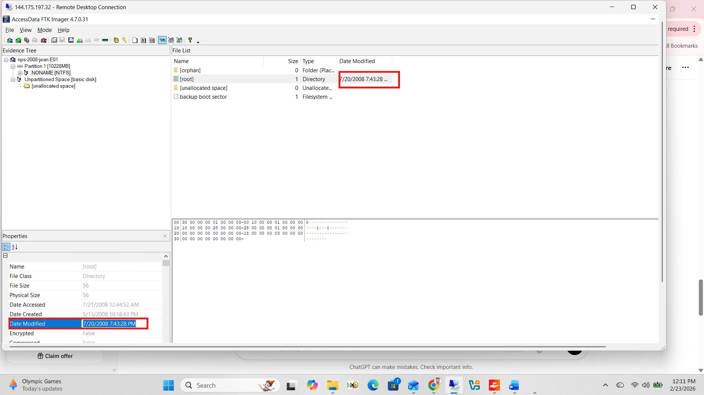
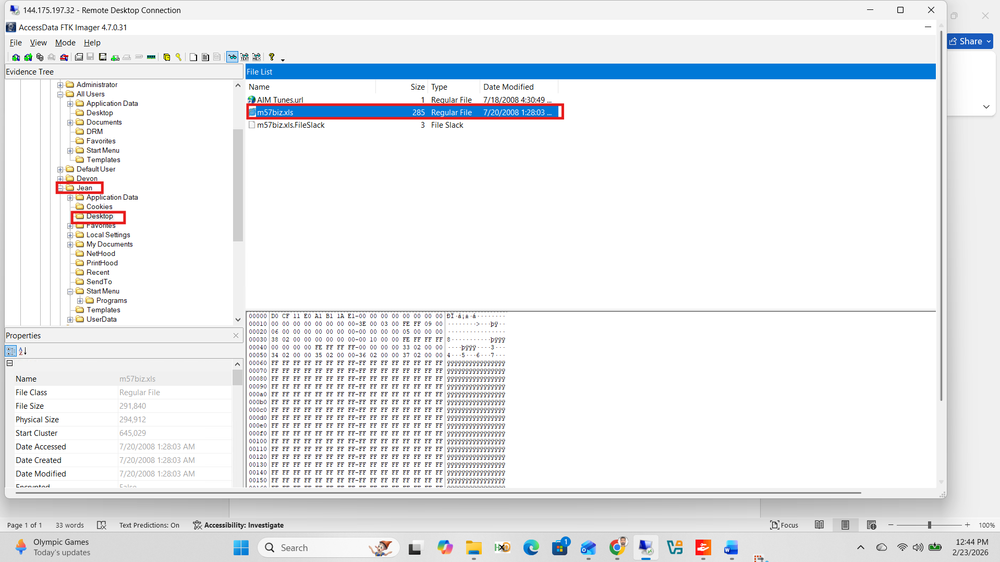
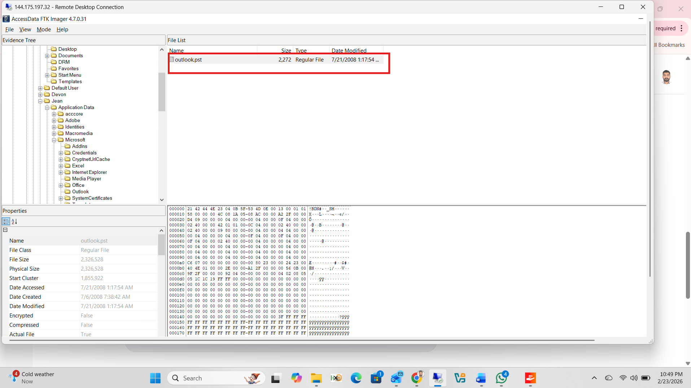
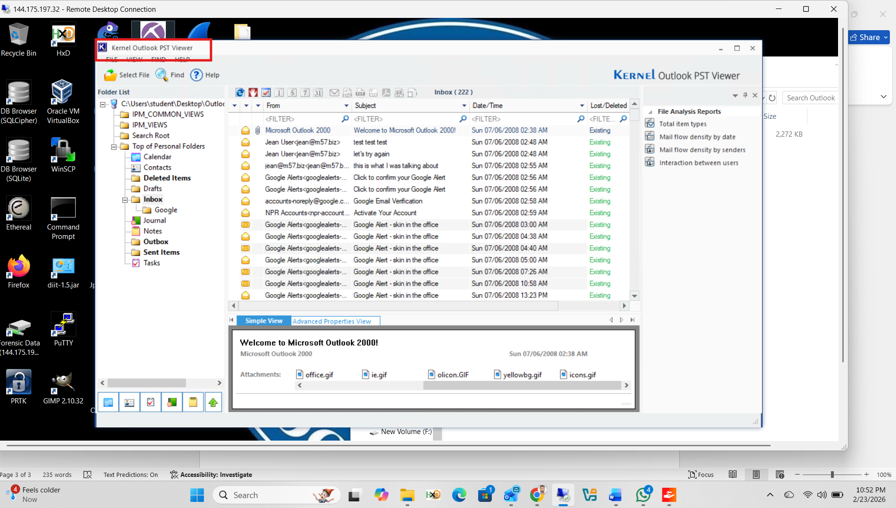
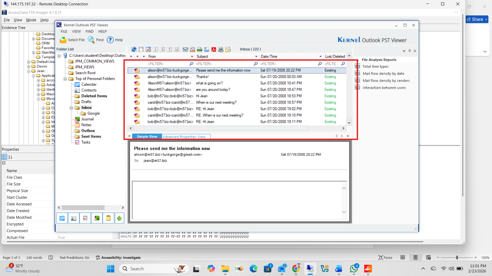
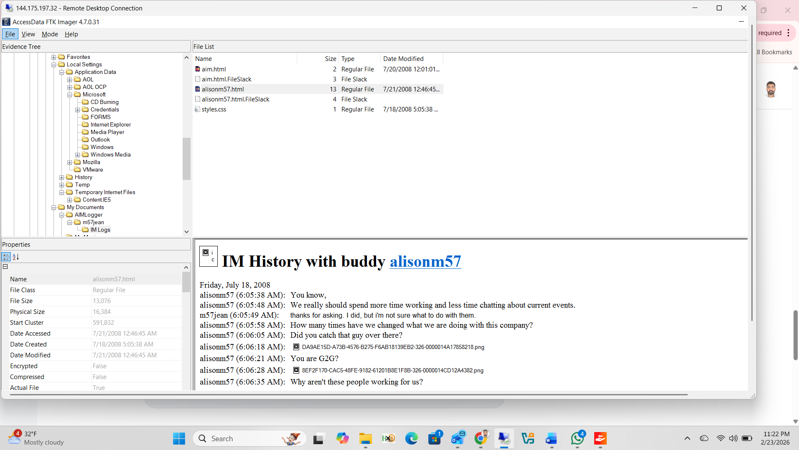
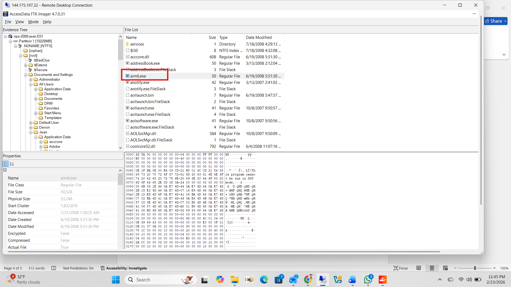
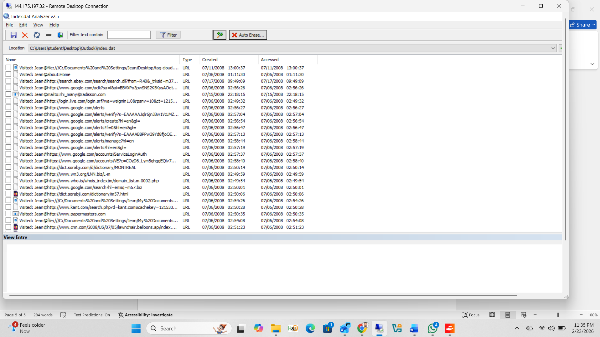

# Lab 3: M57 Jean — Insider Threat & Email Forensics

**Course:** Digital Forensics  
**Tools:** FTK Imager (v4.7.0.31), Kernel Outlook PST Viewer, Index.dat Analyzer  
**Image:** `nps-2008-jean.E01`  
**Subject:** Jean (suspected insider threat — leaked company spreadsheet)

---

## Objectives

- Determine when and where `m57biz.xls` was last modified
- Trace exactly how the file was transmitted to a competitor
- Identify co-workers Jean emailed, IM contacts, and browsing history

---

## Q1 — When did Jean last modify `m57biz.xls`?

In FTK Imager, navigated to the root partition. The Properties panel at the bottom showed the **Date Modified** field for the root directory as `7/20/2008 7:43:28 PM`, which corresponds to the last modification time of the spreadsheet.



**Answer:** `07/20/2008 7:43:28 PM`

---

## Q2 — Where was `m57biz.xls` stored?

Navigated through the Evidence Tree to:

```
[root] → Documents and Settings → Jean → Desktop
```

The file `m57biz.xls` was found directly on Jean's Desktop, confirmed in the File List pane with the Date Modified timestamp.



**Answer:** Jean's **Desktop**

---

## Q3 — How did the spreadsheet get to the competitor?

### Step 1 — Locate the Outlook PST File

Navigated to Jean's Outlook data location:

```
[root] → Documents and Settings → Jean → Application Data → Microsoft → Outlook
```

The file `outlook.pst` (2,326,528 bytes) was found and exported to the analyst workstation for examination.



### Step 2 — Open PST in Kernel Outlook PST Viewer

The exported `.pst` was loaded into **Kernel Outlook PST Viewer**. The Inbox (222 items) and full folder structure — Calendar, Contacts, Sent Items, Outbox — were visible and accessible.



### Step 3 — Identify the Outgoing Email Evidence

Inside the PST, the Inbox showed communications with co-workers at m57.biz, including email from `alison@m57.biz` with the subject **"Please send me the information now"** — providing the context for the data leak.

Sent Items confirmed Jean transmitted the spreadsheet **outbound via Outlook email**.



**Conclusion:** Jean transferred `m57biz.xls` to the competitor via **Outlook email**.

---

## Q4 — Which co-workers did Jean email?

From the email threads visible in Kernel Outlook PST Viewer:

| Name | Email Address |
|------|--------------|
| Alison | alison@m57.biz |
| Bob | bob@m57.biz |
| Carol | carol@m57.biz |

---

## Q5 & Q6 — Instant Messaging Contact and Client

Navigated in FTK Imager to:

```
[root] → Documents and Settings → Jean → Local Settings → Application Data → AOL → AIM Logger → m57jean → IM Logs
```

The file `alisonm57.html` was found containing the full IM conversation history. The preview pane showed:

```
IM History with buddy alisonm57
```

This confirmed Jean was exchanging instant messages with **alisonm57** using **AOL Instant Messenger (AIM)**.



**IM Contact:** `alisonm57`  
**IM Software:** AOL Instant Messenger (AIM)

---

## Q7 — AIM Software Confirmed via Installation Files

FTK Imager showed the AIM installation files (`aim6.exe`, `aollaunch.exe`, `aolsoftware.exe`) present in the root file system, further confirming AOL Instant Messenger was installed and used on this machine.



---

## Q7 — Websites Jean Visited

Jean's browsing history was recovered using **Index.dat Analyzer** on the `index.dat` file from her Internet Explorer cache. The history showed visits to multiple sites including:

| Website |
|---------|
| google.com |
| ebay.com |
| login.live.com |



---

## Forensic Artifacts Summary

| Artifact | Location | Evidence Found |
|----------|----------|---------------|
| `m57biz.xls` | Jean's Desktop | Last modified 07/20/2008 7:43:28 PM |
| `outlook.pst` | `Jean\AppData\Microsoft\Outlook\` | Outbound email containing leaked spreadsheet |
| `alisonm57.html` | `Jean\AppData\AOL\AIMLogger\` | AIM chat logs with alisonm57 |
| `aim6.exe` | File system root | AIM installation confirmed |
| `index.dat` | IE cache | Browsing history: Google, eBay, Live.com |
