# Lab 4: Windows Registry Forensics — Washer Image

**Course:** Digital Forensics  
**Tools:** FTK Imager (v4.7.0.31), AccessData Registry Viewer  
**Image:** Washer disk image

---

## Objectives

- Export SAM and SYSTEM registry hives from a Windows disk image
- Analyze user accounts, login history, and system configuration
- Generate forensic reports from registry data

---

## Step 1: Create Working Directory

A folder named **Washer Registry Files** was created on the Desktop to store exported registry hives and generated reports.

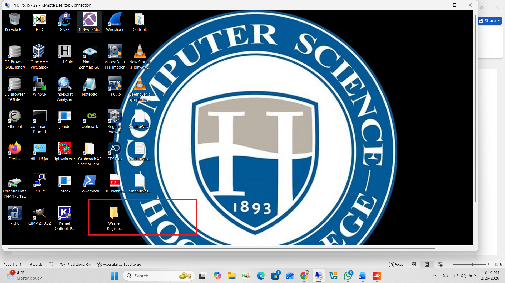

---

## Step 2: Export SAM and SYSTEM Files via FTK Imager

In FTK Imager, navigated through the Washer image to:

```
[Washer Image] → Partition → Windows → System32 → config
```

Both **SAM** and **SYSTEM** files were located and exported to the Washer Registry Files folder.

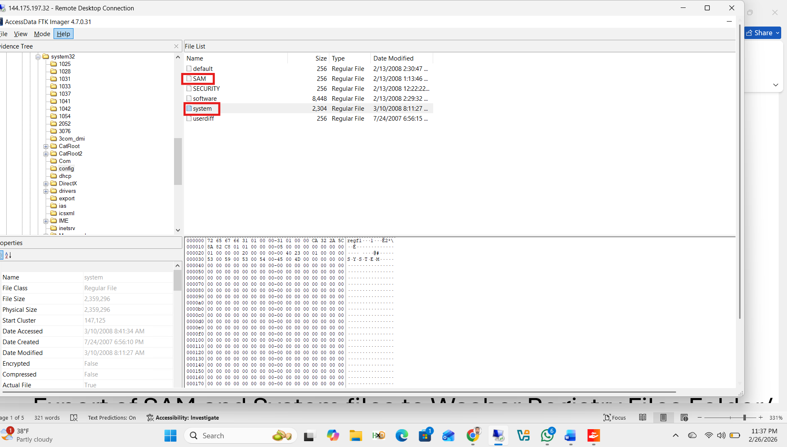

---

## SAM File Analysis

### Q3a — How many user accounts are listed?

The SAM hive was opened in AccessData Registry Viewer. Navigating to `SAM\SAM\Domains\Account\Users\Names` revealed the full account list.

**Accounts found:** Administrator, Artimus, Billy Bob Brubeck, Captian Hook, Guest, HelpAssistant, Mr Smee, SUPPORT_388945a0, The Wolf

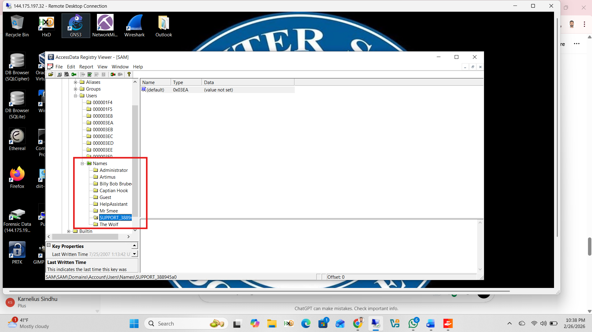

**Answer:** **9 user accounts**

---

### Q3b, Q3c, Q3d — The Wolf's RID, Last Logon, and Logon Count

Selected user key `000003EC` in the Users hive. The Key Properties panel at the bottom displayed all account details for The Wolf.

**RID:** 1004  
**User Name:** The Wolf  
**Logon Count:** 22  
**Last Logon Time:** 2/13/2008 2:17:09 UTC

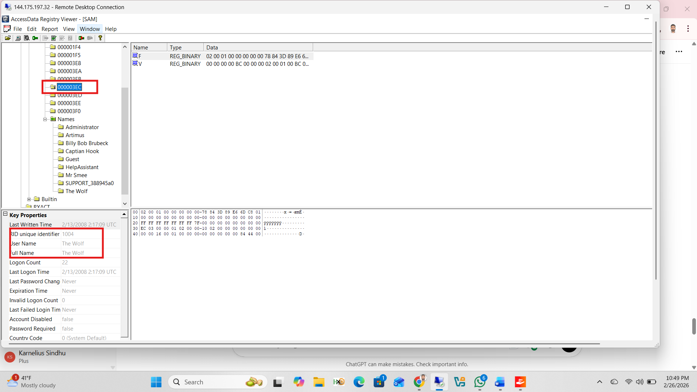

The **Last Logon Time** field highlighted separately, confirming `2/13/2008 2:17:09 UTC`.

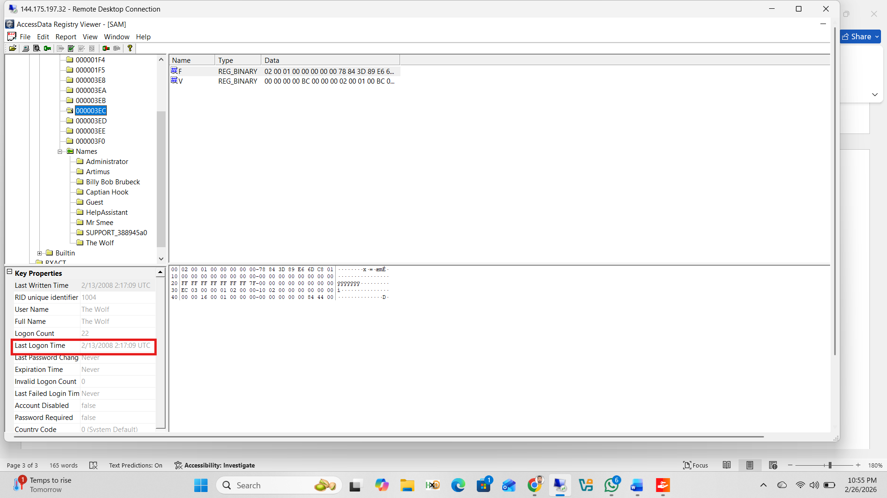

The **Logon Count of 22** highlighted in the Key Properties panel.

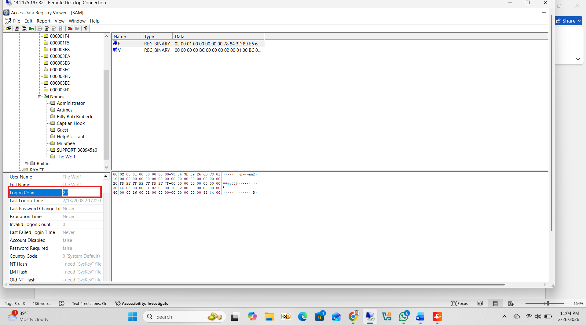

---

### Generating the SAM Report

Right-clicked the SAM hive root → selected **Add to Report with Children** to include all sub-keys and user account data.

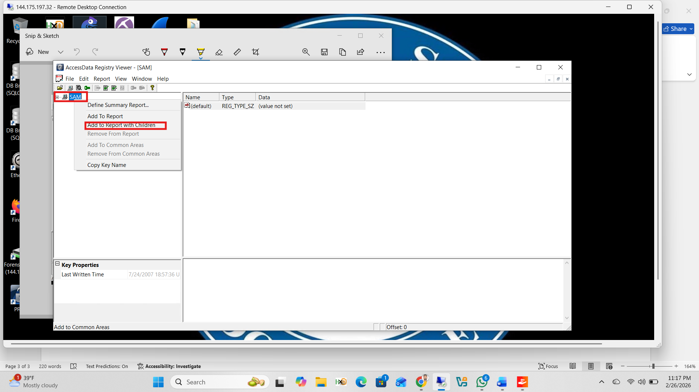

Then navigated to **Report → Generate Report** to produce the final output.

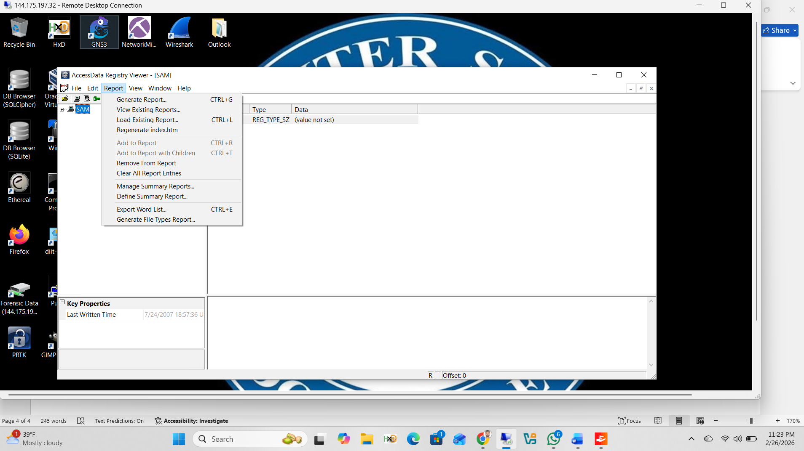

The report was named **Sindhu_SAM_Registry_Report** and saved to the Washer Registry Files folder.

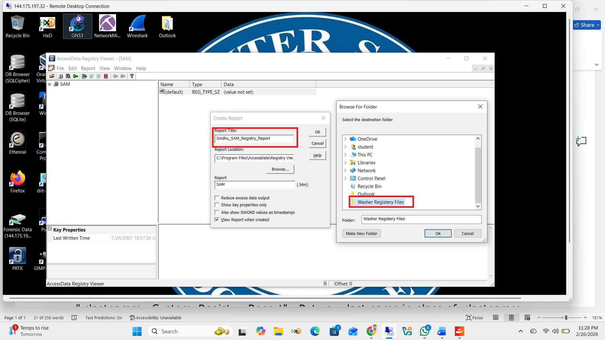

The completed report opened in Firefox, displaying the full Registry Viewer Report titled **Sindhu_SAM_Registry_Report**.

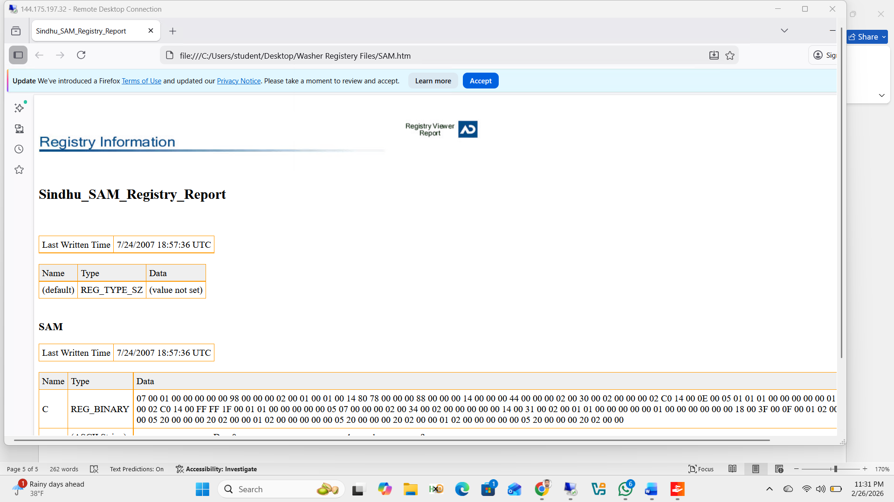

---

## SYSTEM File Analysis

### Q6a — Which control set is being used?

The SYSTEM hive was opened in Registry Viewer. The `Select` key showed **Current = 1**, confirming **ControlSet001** is the active control set.

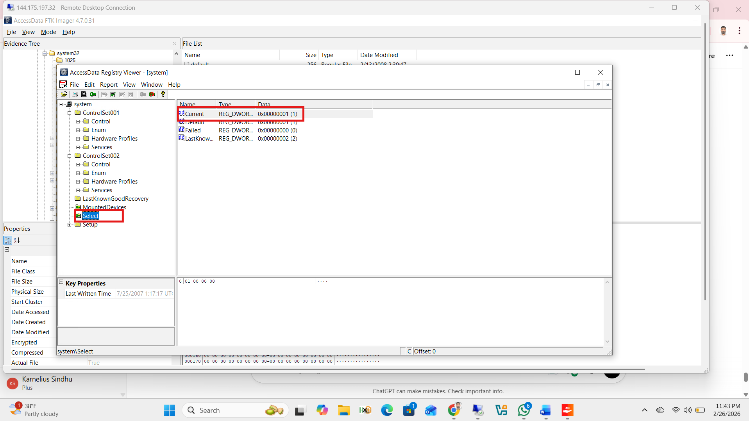

---

### Q6b — Current Time Zone Setting

Navigated to:

```
SYSTEM\ControlSet001\Control\TimeZoneInformation
```

The key values confirmed:

| Value | Data |
|-------|------|
| StandardName | Eastern Standard Time |
| DaylightName | Eastern Daylight Time |
| Bias | 0x0000012C (300 minutes = UTC-5) |
| DaylightBias | 0xFFFFFC4 (–60 minutes) |
| Standard Start Date | Last Sun in Oct at 2:00:00 AM |
| Daylight Start Date | First Sun in Apr at 2:00:00 AM |

**Answer:** **Eastern Time Zone (UTC-5)**

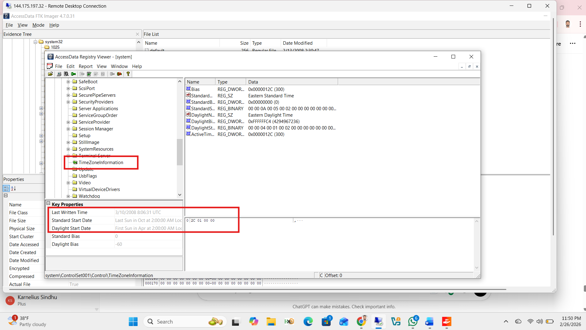

---

### Q6c — Is Daylight Saving Time configured?

**Answer: Yes**

Three pieces of evidence confirm DST is configured:
- `DaylightName` value present: `Eastern Daylight Time`
- `DaylightBias` = `-60` (one-hour forward adjustment)
- Daylight transition dates configured: First Sunday in April at 2:00 AM

---

### Generating the SYSTEM Report

Right-clicked the SYSTEM hive → **Report → Generate Report**.

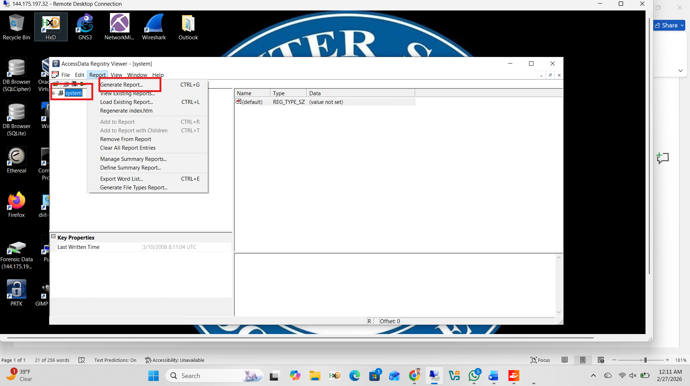

The report titled **Sindhu_System_Registry_Report** was saved to the Washer Registry Files folder and opened showing **ControlSet001** structure.

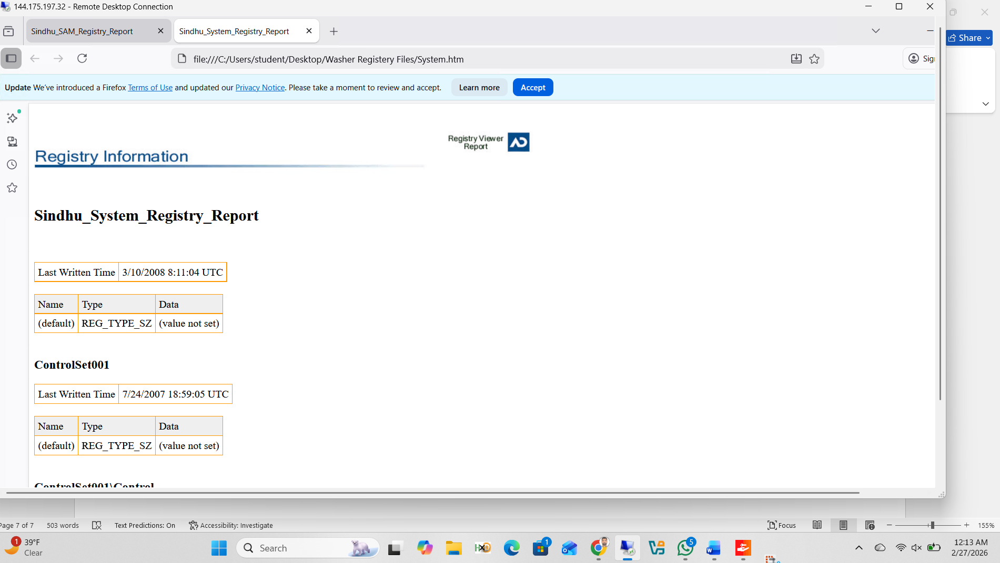

---

## Registry Paths Reference

| Question | Registry Path |
|----------|--------------|
| User accounts | `SAM\SAM\Domains\Account\Users\Names` |
| User key properties | `SAM\SAM\Domains\Account\Users\[RID]` |
| Active control set | `SYSTEM\Select` |
| Time zone info | `SYSTEM\ControlSet001\Control\TimeZoneInformation` |
