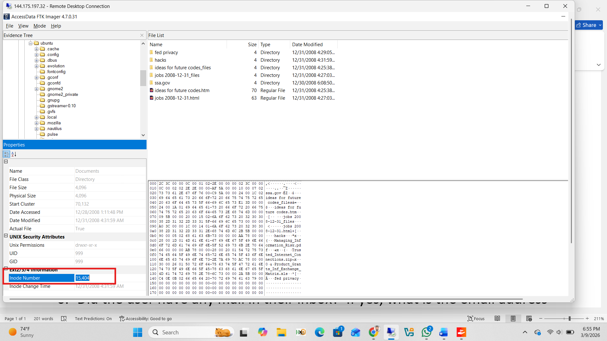
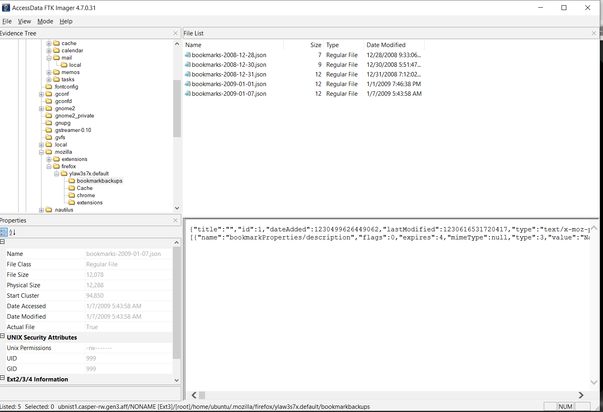
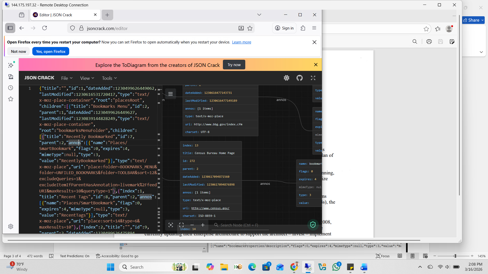
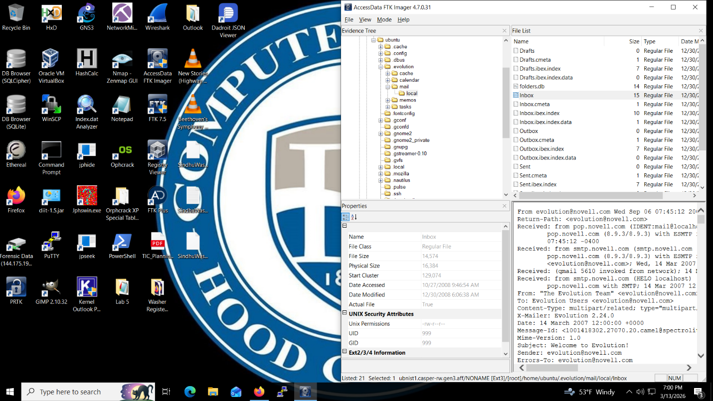
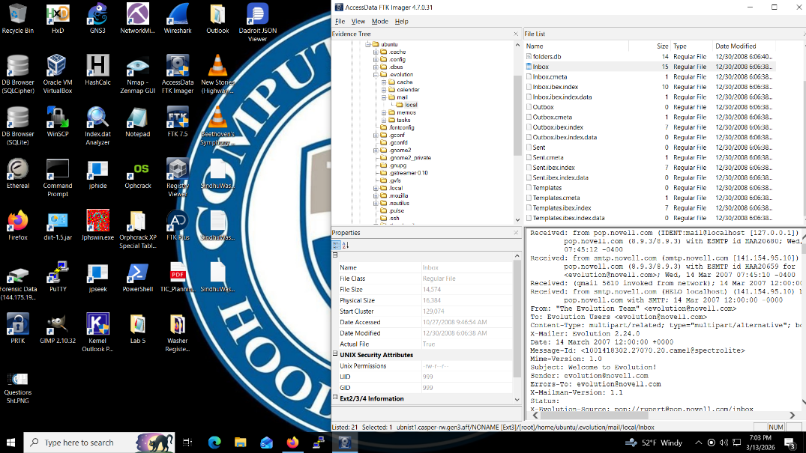
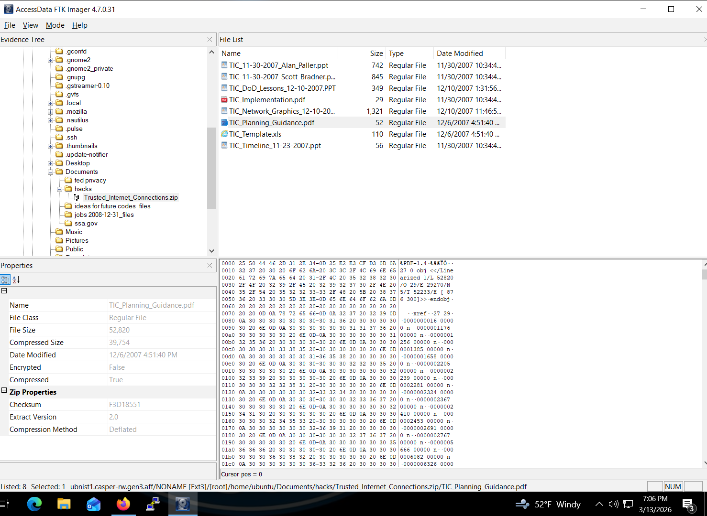
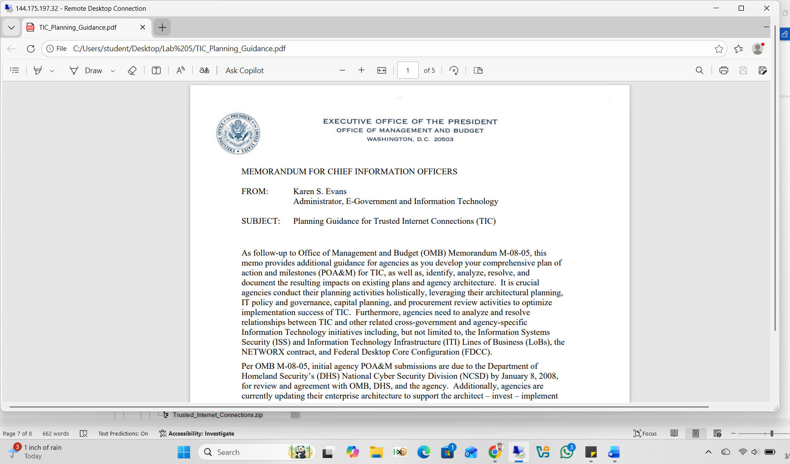

# Lab 5: Drawing Conclusions — Unix Disk Image Forensics

**Course:** Digital Forensics  
**Tools:** FTK Imager (v4.7.0.31), JSON Crack (jsoncrack.com)  
**Image:** `ubnist1.casper-rw.gen3.aff`

---

## Objectives

- Identify the OS and file system of a Unix disk image
- Understand inode data structures
- Recover browser bookmarks, email artifacts, and documents
- Draw conclusions about the user's activity and intent

---

## Q1 — What is the operating system and file system?

In FTK Imager, the partition label showed **NONAME [Ext3]**, identifying the file system. The `sources.list` file in `/etc/apt/` confirmed the distribution as **Ubuntu 8.10 Intrepid Ibex**.

```
deb cdrom:[Ubuntu 8.10 Intrepid Ibex - Release i386 (20081029.5)]/ intrepid main restricted
```

![FTK Imager — NONAME [Ext3] partition with sources.list showing Ubuntu 8.10](screenshots/image1.png)

**OS:** Ubuntu 8.10 (Intrepid Ibex) — Linux  
**File System:** EXT3

---

## Q2 — What is the inode number of the Documents directory?

Navigated to the ubuntu user's home directory:

```
[root] → home → ubuntu → Documents
```

The Properties panel at the bottom showed the **Ext2/3/4 Information** section with the **Inode Number** field.



**Answer:** Inode Number = **15,404**

---

## Q3 — What websites were bookmarked on 1-7-2009?

### Step 1 — Locate the Bookmarks File in FTK Imager

Navigated to the Firefox profile bookmarks backup folder:

```
[root] → home → ubuntu → .mozilla → firefox → ylaw3s7x.default → bookmarkbackups
```

The file `bookmarks-2009-01-07.json` (dated 1/7/2009 5:43:58 AM) was found and exported.



### Step 2 — Parse JSON with JSON Crack

The exported `.json` bookmarks file was loaded into **JSON Crack** (jsoncrack.com/editor) for visual parsing. The structured output clearly showed two bookmarked URLs with their titles.



**Bookmarks found:**

| # | URL |
|---|-----|
| 1 | http://www.bbg.gov/index.cfm |
| 2 | http://www.census.gov/ |

Both are legitimate U.S. government websites.

---

## Q4 — What mail client does the user have?

Navigated to the Evolution mail data directory:

```
[root] → home → ubuntu → .evolution → mail → local → Inbox
```

The Inbox file was selected and the preview pane displayed the email header. The `X-Mailer` field confirmed:

```
X-Mailer: Evolution 2.24.0
```



**Mail Client:** **Evolution 2.24.0**

---

## Q5 — Was there mail in the Inbox? Who sent it?

The Inbox contained one email. The full header was visible in the FTK Imager preview:

```
From: evolution@novell.com
Sender: evolution@novell.com
Subject: Welcome to Evolution!
X-Mailer: Evolution 2.24.0
```



**Answer:** Yes — one email, sent from **evolution@novell.com**

---

## Q6 — TIC Planning Guidance Document

Navigated to:

```
[root] → home → ubuntu → Documents → hacks → Trusted_Internet_Connections.zip
```

Inside the zip archive, **TIC_Planning_Guidance.pdf** was found alongside other TIC-related documents.



The PDF was exported and opened, revealing the official OMB memorandum.



**Document:** `TIC_Planning_Guidance.pdf`  
**Memorandum For:** Chief Information Officers (CIOs) of Federal Departments and Agencies  
**From:** Karen S. Evans, Administrator for E-Government and Information Technology, OMB  
**Pages:** 5

---

## Q7 — Was the user acting honestly or committing a crime?

**Conclusion: Acting honestly — no criminal intent found**

Evidence supporting this conclusion:

| Artifact | Finding |
|----------|---------|
| Bookmarks | `bbg.gov` and `census.gov` — legitimate U.S. government sites |
| Documents | `TIC_Planning_Guidance.pdf` — official federal cybersecurity policy document |
| Email | Welcome email from Evolution — no suspicious communications |
| Overall pattern | Research and preparation related to Trusted Internet Connections (TIC) |

The user appears to be conducting legitimate professional or academic research on federal IT security policy. No evidence of data theft, unauthorized access, or malicious activity was found.

---

## Forensic Artifacts Summary

| Artifact | Path | Finding |
|----------|------|---------|
| `sources.list` | `/etc/apt/` | Confirms Ubuntu 8.10 (EXT3) |
| Documents directory | `/home/ubuntu/Documents/` | Inode 15,404 |
| `bookmarks-2009-01-07.json` | `/home/ubuntu/.mozilla/firefox/.../bookmarkbackups/` | bbg.gov, census.gov |
| Evolution Inbox | `/home/ubuntu/.evolution/mail/local/Inbox` | Email from evolution@novell.com |
| `TIC_Planning_Guidance.pdf` | `/home/ubuntu/Documents/hacks/Trusted_Internet_Connections.zip/` | 5-page OMB memo for CIOs |
