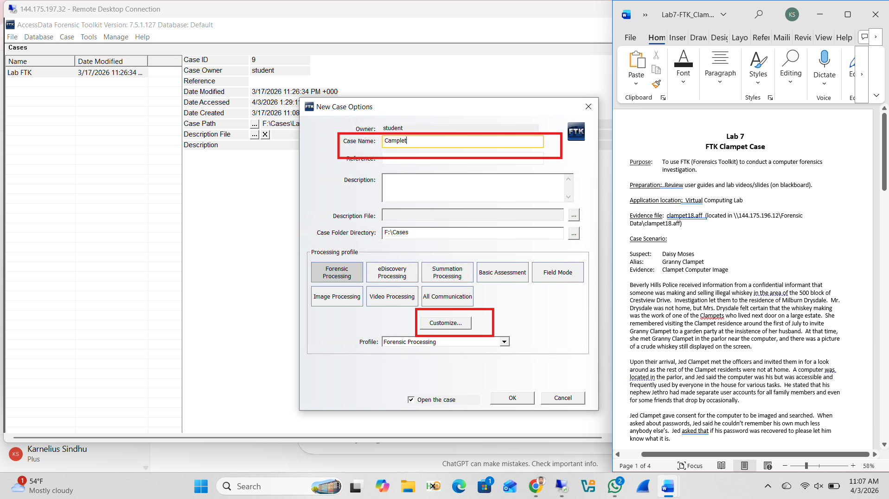
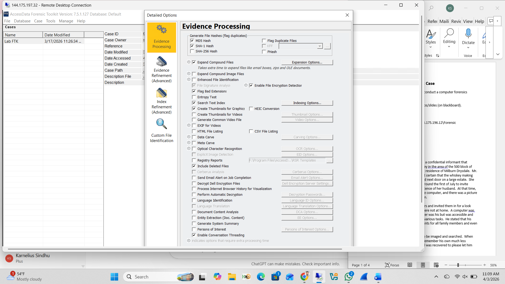
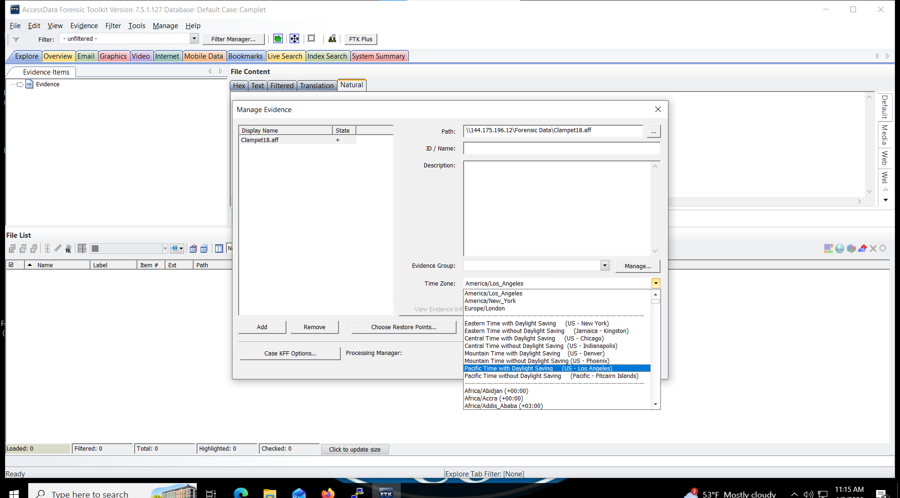
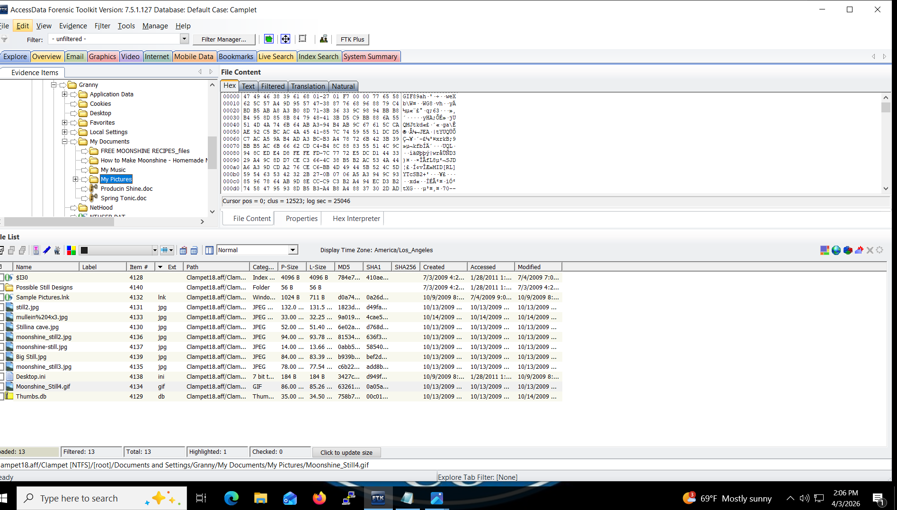
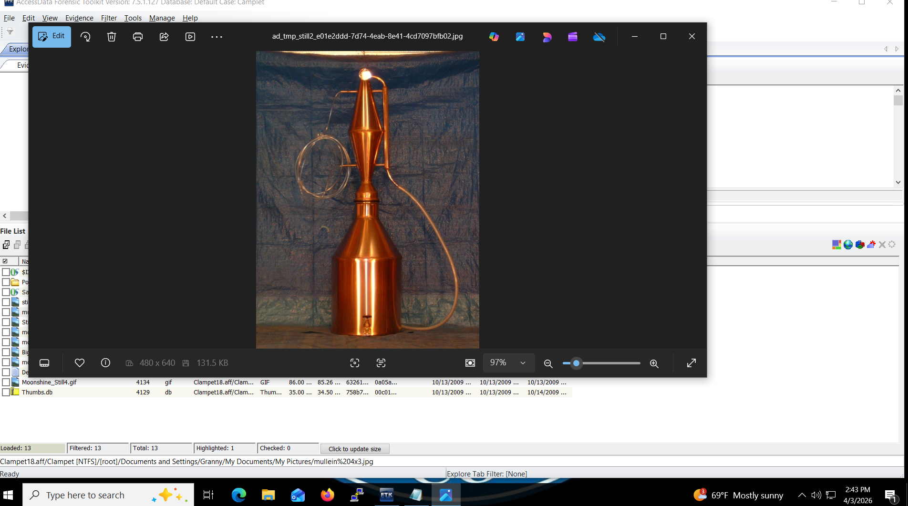
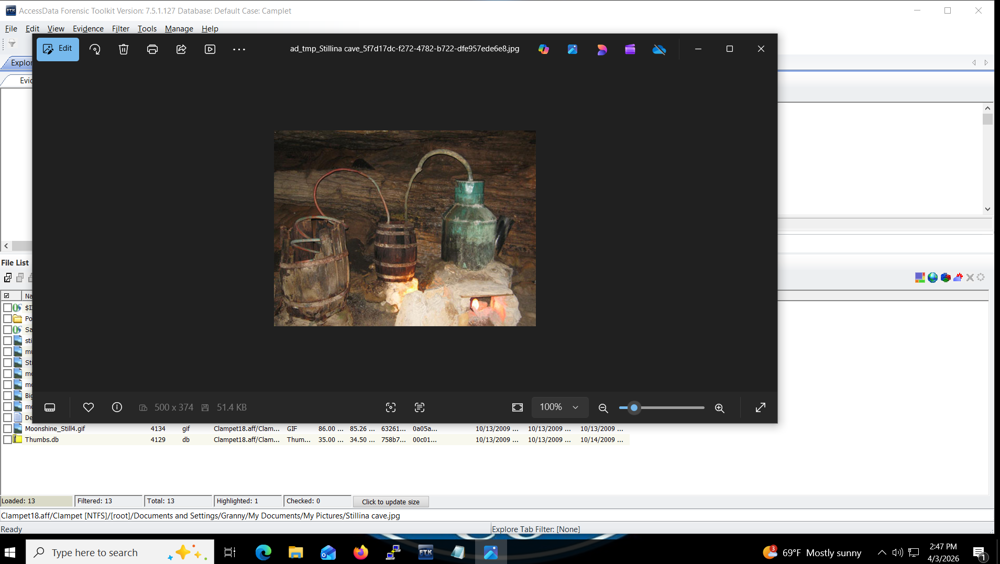
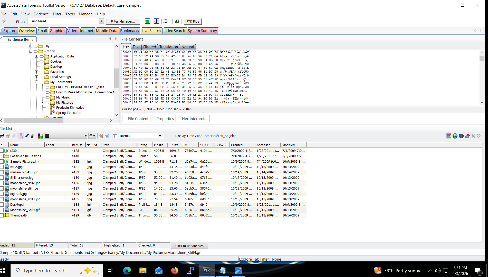
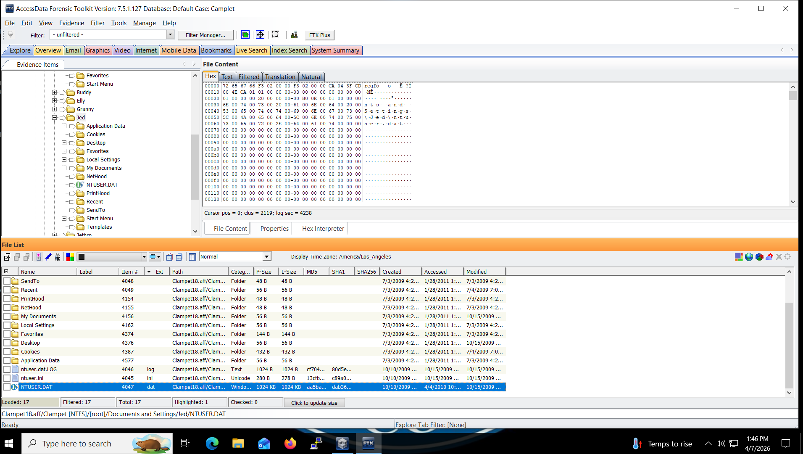

# Clampet FTK Case Investigation

**Course:** Digital Forensics  
**Tools:** AccessData FTK (v7.5.1.127), AccessData Registry Viewer, FTK Imager  
**Evidence File:** `clampet18.aff`  
**Case Name:** Camplet

---

## Case Background

Beverly Hills Police received a tip that someone was making and selling illegal whiskey near Crestview Drive. Investigation led to the Clampet residence. Mrs. Drysdale reported visiting the property and seeing a picture of a crude whiskey still displayed on a computer screen in the parlor. Jed Clampet gave consent to image and search the computer. Multiple user accounts existed — one for each family member plus occasional visitors.

---

## Case Setup

### New Case Created in FTK

A new case named **Camplet** was created in FTK with the evidence file `clampet18.aff` loaded. Processing profile set to **Forensic Processing** with time zone set to **Pacific Daylight Time**.



---

### Evidence Processing Options (Customize)

The following processing options were enabled to ensure comprehensive forensic analysis:

| Option | Purpose |
|--------|---------|
| MD5 Hash + SHA-1 Hash | File integrity verification |
| Expand Compound Files | Extract archives, email containers, OLE documents |
| File Signature Analysis | Identify files by signature regardless of extension |
| Search Text Index | Enable keyword searching across all content |
| Create Thumbnails for Graphics | Preview image evidence |
| Data Carve | Recover deleted/fragmented files |
| Include Deleted Files | Capture deleted evidence |
| Enable Conversation Threading | Group related communications |



---

### Image Loaded — Case Ready

The `clampet18.aff` evidence file was added via **Manage Evidence**, with time zone confirmed as **Pacific Time with Daylight Saving (US — Los Angeles)**.



---

## Part 1 — Graphic Evidence

### Q2 — Whiskey Still Images Located

Navigated in FTK's Evidence Tree to:

```
Granny → My Documents → My Pictures
```

The file list showed multiple graphic files related to whiskey distillation — `moonshine-still.jpg`, `moonshine-still2.jpg`, `moonshine-still3.jpg`, `Moonshine_Still4.gif`, `Stillina cave.jpg`, and more — all located in **Granny's personal My Pictures directory**.



One of the still images opened and displayed — a copper whiskey distillation apparatus consistent with moonshine production.



A second image (`Stillina cave.jpg`) showing a full moonshine still setup with barrels and tubing in a cave environment.



The complete file list in Granny's My Pictures directory confirming all moonshine still images alongside a folder named **FREE MOONSHINE RECIPES_files** and documents titled **How to Make Moonshine** and **Producin Shine.doc**.



---

### Whiskey Evidence Bookmarked in FTK

The key image files were bookmarked under **Whiskey Evidence** with the comment:

```
Image of whiskey still used for illegal distillation
```

Files bookmarked: `moonshine-still.jpg`, `moonshine-still3.jpg`, `Moonshine_Still4.gif`


---

### Q3 — Primary Suspect

**Answer: Granny Clampet**

All whiskey still images, moonshine recipe files, and distillation documents were located within **Granny's personal user directory** (`Documents and Settings\Granny\My Documents\My Pictures`). Their presence directly corroborates Mrs. Drysdale's statement.

---

## Part 2 — Registry Analysis

### Q5 — Jed's NTUSER.DAT Located

Navigated in FTK to:

```
[root] → Documents and Settings → Jed → NTUSER.DAT
```

The NTUSER.DAT file was identified in Jed's profile directory (1,024 KB, highlighted in blue) and exported to Registry Viewer for analysis.



---

### Granny's Typed URLs

Exported Granny's NTUSER.DAT and opened in AccessData Registry Viewer. Navigated to:

```
Software\Microsoft\Internet Explorer\TypedURLs
```

**Typed URLs found (all timestamped 07/03/2009 22:34:22 UTC):**

| URL |
|-----|
| http://www.google.com/ |
| http://www.live.com/ |
| http://www.yahoo.com/ |
| http://www.dogpile.com/ |
| http://www.microsoft.com/isapi/redir.dll... |

---

### Q6 — Granny's Home Page

**Registry Path:** `NTUSER.DAT → Software\Microsoft\Internet Explorer\Main`

**Answer:** `www.dogpile.com`

---

### Q7 — Printer Information

- **Granny:** SnagIt 7 (from `Software\Microsoft\Windows NT\CurrentVersion\Devices`)
- **Buddy:** SnagIt 7 (from `Software\Microsoft\Windows NT\CurrentVersion\Windows`)
- **Jethro:** Microsoft Office Document Image Writer (from `Software\Microsoft\Windows NT\CurrentVersion\Windows`)

---

### Q12 — Registered Owner and USB Storage Devices

**Registry Path (SOFTWARE hive):** `Microsoft\Windows NT\CurrentVersion`

| Field | Value |
|-------|-------|
| Registered Owner | Jed |
| Registered Organization | Clampett Industries |

**Registry Path (SYSTEM hive):** `SYSTEM\ControlSet001\Enum\USBSTOR`

USB storage devices connected:

| Device |
|--------|
| SanDisk Cruzer Micro USB Device |
| SanDisk Cruzer Mini USB Device |
| USB Flash Disk Device |
| Western Digital (WD) 1600BEV External Drive |
| Western Digital (WD) 3200BMV External Drive |
| WIBU CodeMeter USB Stick |

---

### Q14 — Granny's Last Logon

**Registry Path:** `SAM\SAM\Domains\Account\Users\000003EE`

**Last Logon Time:** `7/3/2009 23:10:23 UTC`

---

### Q15 — Were Most Accounts Used Multiple Times?

**Answer: Yes**

- Help, Administrator, and Guest accounts showed 0 logon counts
- All other active accounts (Jed, Granny, Buddy, Elly, Jethro) showed multiple logons
- Jethro had the highest count at **52 total logons**

---

## Q16 — Deleted Graphics (Non-Carved) Filter

A custom filter was created in FTK's Filter Manager:

| Rule | Property | Operator | Value |
|------|----------|----------|-------|
| 1 | File Category | Is a Member Of | Graphics |
| 2 | Deleted | Is True | — |
| 3 | Carved | Is False | — |
| Logic | **Match All** | — | — |

**Result: 22 deleted non-carved graphic files identified**

---

## Key Evidence Summary

| Finding | Detail |
|---------|--------|
| Whiskey still images | `moonshine-still.jpg`, `moonshine-still3.jpg`, `Moonshine_Still4.gif` + others |
| Image location | Granny's personal My Pictures directory |
| Recipe files | `FREE MOONSHINE RECIPES_files`, `How to Make Moonshine`, `Producin Shine.doc` |
| Granny's home page | www.dogpile.com |
| Last IE typed URLs | 07/03/2009 22:34:22 UTC |
| Jethro's email | Gmail (POP3 via pop.gmail.com) |
| Registered owner | Jed / Clampett Industries |
| USB devices | 6 devices (SanDisk, Western Digital, WIBU) |
| Granny's last logon | 7/3/2009 23:10:23 UTC |
| Deleted graphics (non-carved) | 22 files |
| Primary suspect | **Granny Clampet** |
