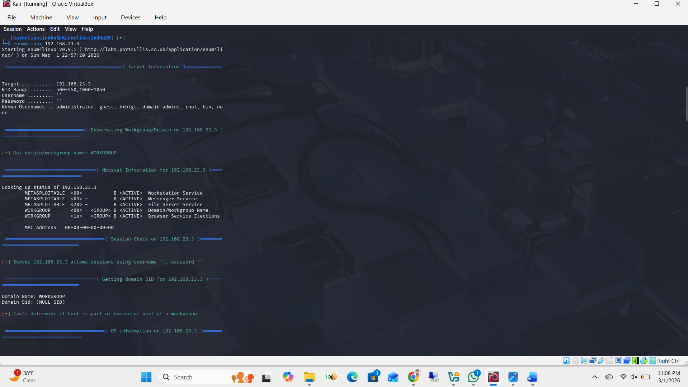
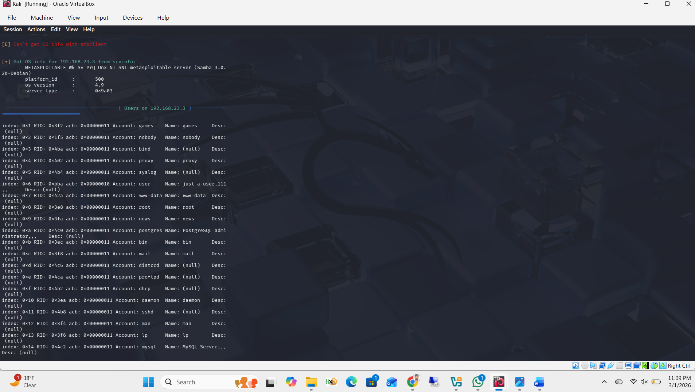
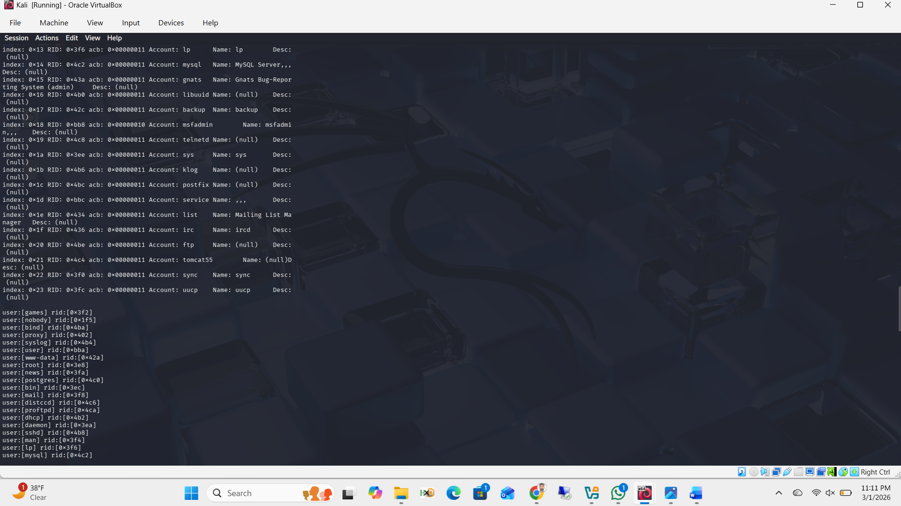
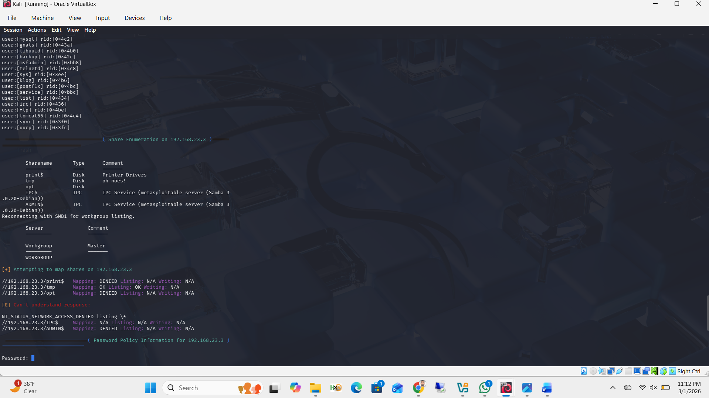
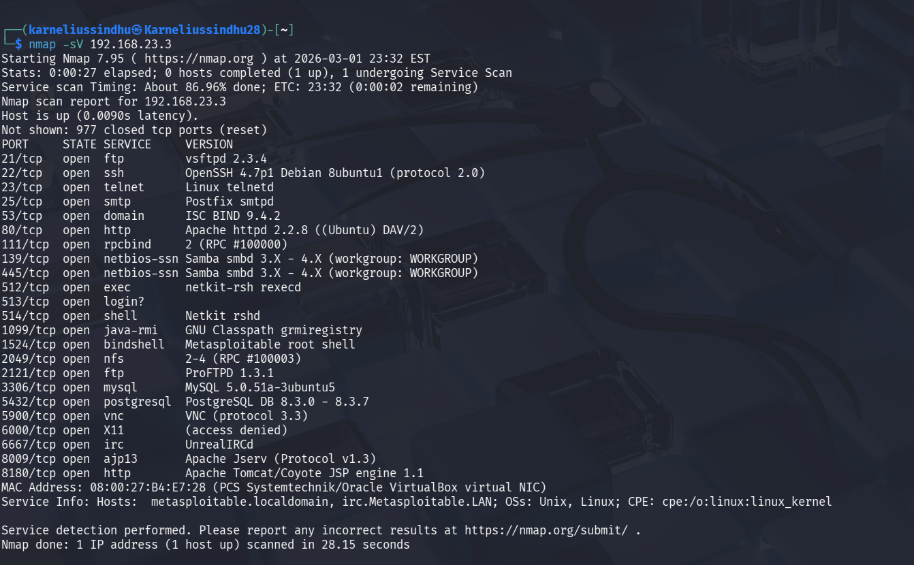
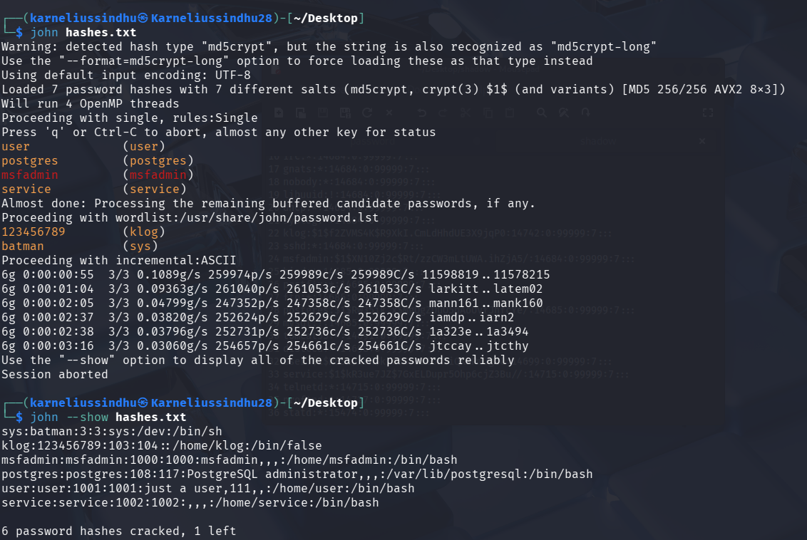

# Lab 10: Hacking Metasploitable2 — Enumeration & Password Cracking

**Course:** Ethical Hacking  
**Tools:** Enum4linux, Nmap, John the Ripper  
**Target:** Metasploitable2 (`192.168.23.3`)

---

## Objectives

- Perform full network enumeration against Metasploitable2
- Identify OS, services, users, shares, and security misconfigurations
- Crack password hashes with John the Ripper

---

## Step 1: Enum4linux — Target Information, Nbtstat, Null Session

```bash
enum4linux 192.168.23.3
```

Enum4linux ran a comprehensive enumeration covering target info, Nbtstat data, session check, OS info, user listing, share enumeration, and password policy. Key findings:

- **Hostname:** METASPLOITABLE
- **Workgroup:** WORKGROUP
- **File Server Service** running
- **Null session allowed:** `[+] Server 192.168.23.3 allows sessions using username '', password ''`
- **Domain SID:** NULL SID — not a true AD domain



---

## Step 2: OS Info and User Enumeration

Enum4linux retrieved OS information via `srvinfo`:

```
Samba 3.0.20-Debian
OS version: 4.9
```

Full user list enumerated via null session — including accounts like `games`, `nobody`, `proxy`, `user`, `www-data`, `root`, `postgres`, `msfadmin`, and more.



---

## Step 3: Extended User List with RIDs

Continuation of user enumeration showing all accounts with their RIDs (Relative Identifiers), confirming services like `mysql`, `gnats`, `libuuid`, `backup`, `msfadmin`, `telnetd`, `ftp`, `tomcat55`, and more.



---

## Step 4: Share Enumeration and Password Policy

Share enumeration via null session revealed accessible shares:

| Share | Type | Comment |
|-------|------|---------|
| tmp | Disk | oh noes! |
| print$ | Disk | Printer Drivers |
| opt | Disk | — |
| IPC$ | IPC | IPC Service |
| ADMIN$ | IPC | IPC Service |

**Password Policy:** Blank — no minimum length, complexity, or lockout policy enforced. High susceptibility to brute force.



---

## Step 5: Nmap Service Version Scan

```bash
nmap -sV 192.168.23.3
```

Full service version detection confirming all open ports and their exact versions — used to answer the specific port questions.

| Port | Service | Version |
|------|---------|---------|
| 21/tcp | FTP | vsftpd 2.3.4 |
| 53/tcp | DNS | ISC BIND 9.4.2 |
| 8009/tcp | AJP13 | Apache Jserv Protocol v1.3 |
| 139/tcp | Samba | smbd 3.X–4.X |
| 445/tcp | Samba | smbd 3.X–4.X |



---

## Step 6: Password Cracking with John the Ripper

```bash
unshadow passwd shadow > merged.txt
john hashes.txt
john --show hashes.txt
```

After merging `/etc/passwd` and `/etc/shadow` with `unshadow`, John the Ripper cracked **6 out of 7** hashes. Cracked passwords included weak and default credentials.

**Cracked credentials:**

| Username | Password |
|----------|----------|
| user | user |
| postgres | postgres |
| msfadmin | msfadmin |
| service | service |
| klog | 123456789 |
| sys | batman |



---

## Key Takeaways

| Finding | Risk |
|---------|------|
| Null session allowed | Unauthenticated enumeration of users, shares, OS info |
| No password policy | Weak/default passwords allowed |
| Samba 3.0.20 | Known vulnerable version (CVE-2007-2447) |
| vsftpd 2.3.4 | Contains backdoor vulnerability |
| 6/7 passwords cracked | Default credentials in use across multiple accounts |

---

## Remediation

1. Disable null sessions on Samba (`restrict anonymous = 2`)
2. Enforce strong password policy
3. Update Samba and vsftpd to patched versions
4. Remove or disable unnecessary service accounts
