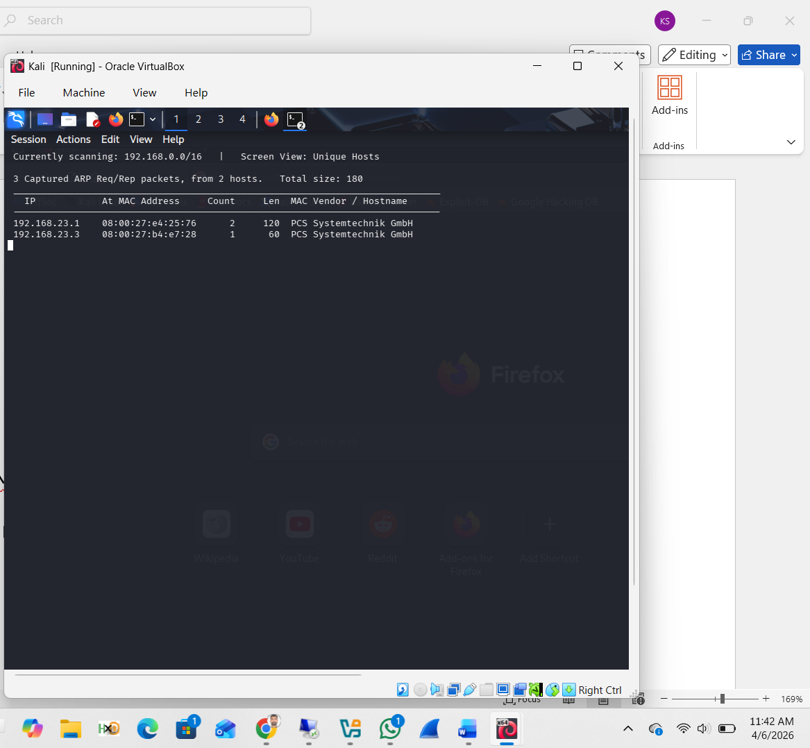
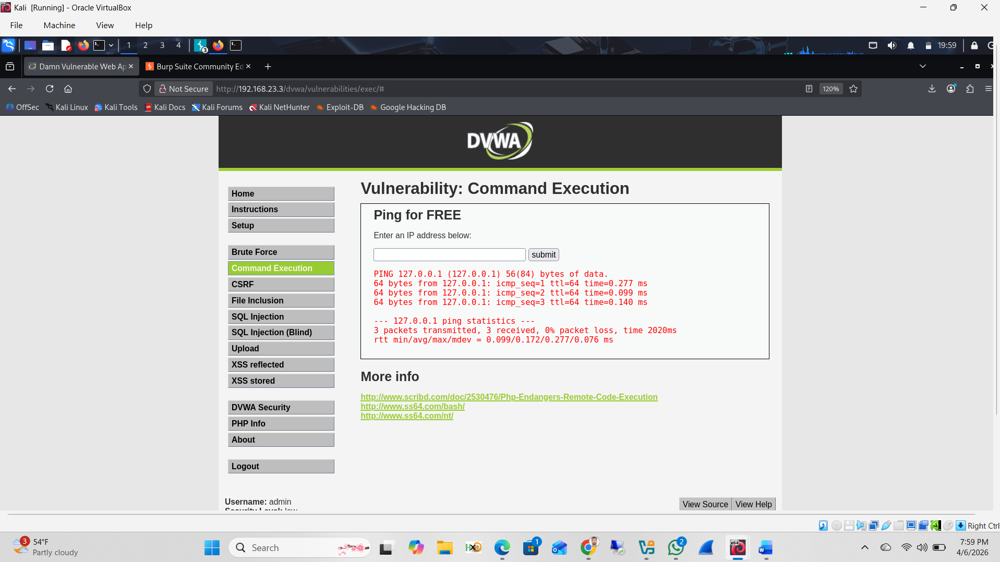
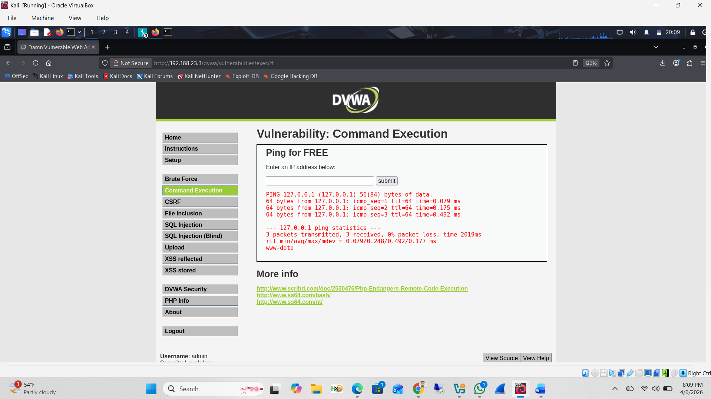
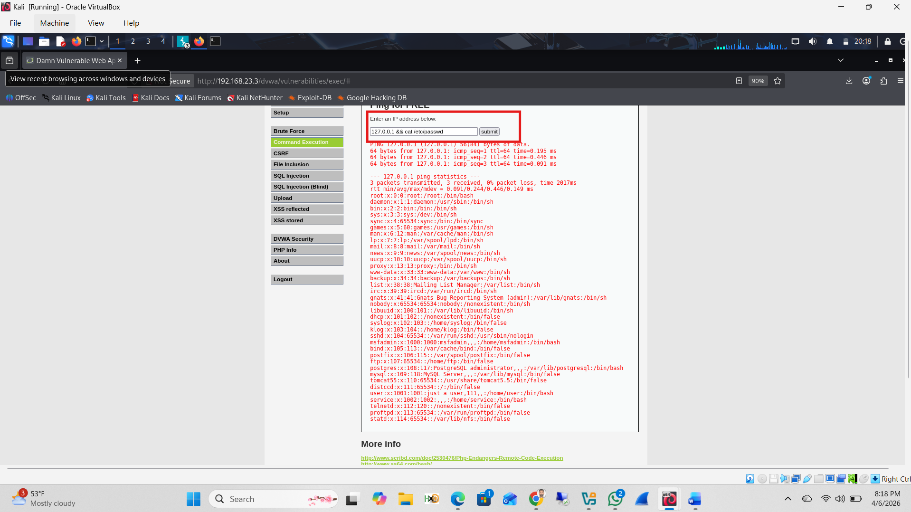
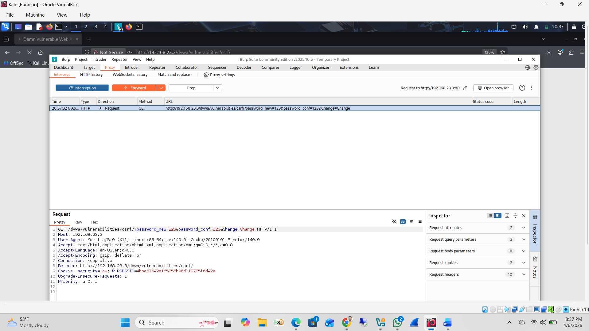
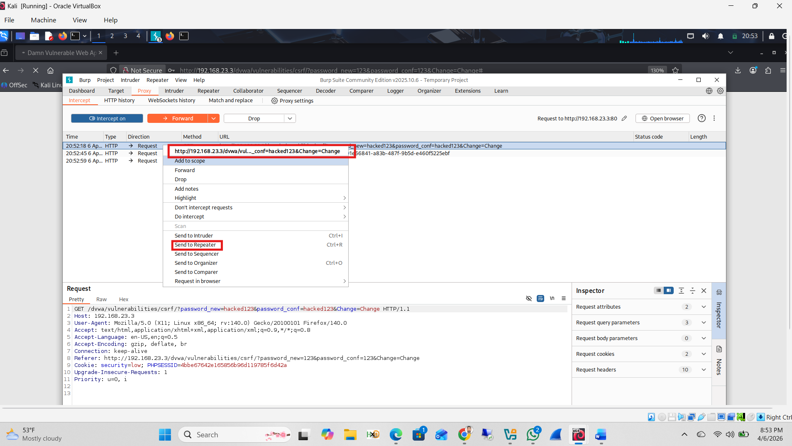
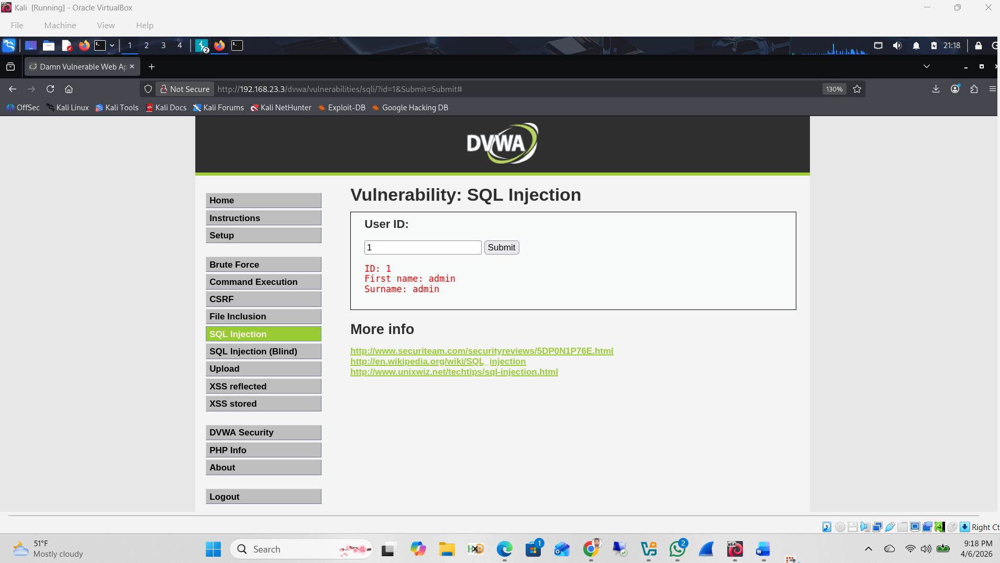
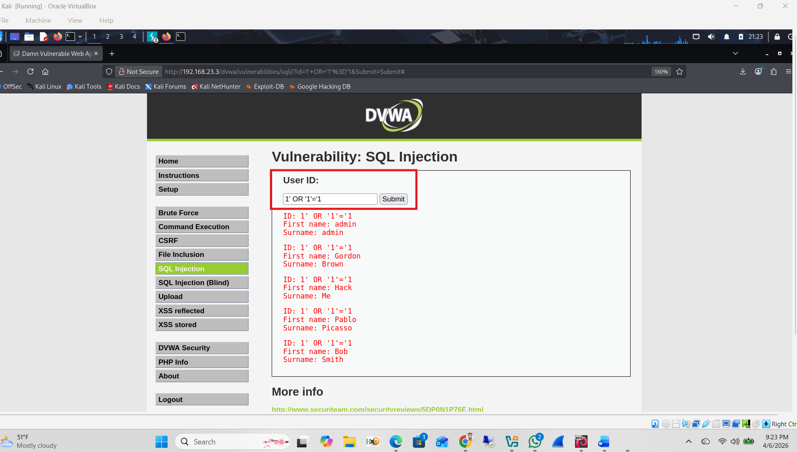
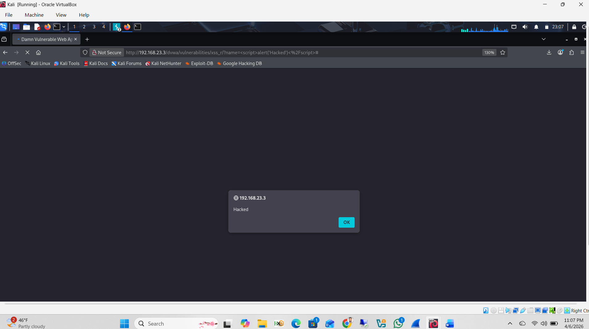

# Lab 21: DVWA Web Application Vulnerabilities

**Course:** Ethical Hacking (CYBR 556)  
**Tools:** Kali Linux, DVWA, Burp Suite, Netdiscover  
**Target:** Metasploitable2 running DVWA (`192.168.23.3`)

---

## Objectives

Exploit four common web application vulnerabilities using DVWA (Damn Vulnerable Web Application):

1. Command Execution
2. CSRF (Cross-Site Request Forgery)
3. SQL Injection
4. XSS (Reflected Cross-Site Scripting)

---

## Setup — Target Discovery

```bash
sudo netdiscover
```

Target Metasploitable2 discovered at `192.168.23.3`. DVWA accessed via browser at `http://192.168.23.3/dvwa`.



---

## 1. Command Execution

### Baseline Test

```
Input: 127.0.0.1
```

Normal ping confirmed the input field reaches the OS and executes system commands.



---

### Payload 2 — `whoami`

```
Input: 127.0.0.1 && whoami
```

The `&&` operator chains a second OS command after the ping. Output returned `www-data`, confirming arbitrary command execution on the web server user.



---

### Payload 3 — Read `/etc/passwd`

```
Input: 127.0.0.1 && cat /etc/passwd
```

Full contents of `/etc/passwd` returned in the browser — all system users exposed including `root`, `msfadmin`, `postgres`, `user`, and more.



**Impact:** Remote Code Execution, system information disclosure, potential privilege escalation.

---

## 2. CSRF (Cross-Site Request Forgery)

### Step 1 — Intercept Password Change

Burp Suite proxy interception enabled. Password change submitted via DVWA CSRF page (new password: `123`). Burp Suite intercepted the GET request:

```
GET /dvwa/vulnerabilities/csrf/?password_new=123&password_conf=123&Change=Change
```



---

### Step 2 — Send to Repeater

Right-clicked the intercepted request and selected **Send to Repeater**. This allows replaying the request to confirm the server accepts it without any CSRF token validation.



---

### Result

Repeater sent the request and received `HTTP 200 OK` — the password change was accepted with no CSRF protection, no re-authentication, and no token required.

**Impact:** An attacker can craft a malicious link that silently changes a victim's password when clicked.

---

## 3. SQL Injection

### Baseline Query

```
Input: 1
```

Normal input returned a single user record:

```
ID: 1 | First name: admin | Surname: admin
```



---

### Injection Payload

```
Input: 1' OR '1'='1
```

The always-true condition bypassed query logic and returned **all records** from the database:

```
ID: 1' OR '1'='1 — admin / admin
ID: 1' OR '1'='1 — Gordon / Brown
ID: 1' OR '1'='1 — Hack / Me
ID: 1' OR '1'='1 — Pablo / Picasso
ID: 1' OR '1'='1 — Bob / Smith
```



**Impact:** Unauthorized database access, full user table exposed, potential for further data exfiltration.

---

## 4. XSS — Reflected Cross-Site Scripting

### Payload

```html
<script>alert('Hacked')</script>
```

The script was injected into the DVWA XSS reflected input field. The application reflected the input back to the browser without sanitization, executing the JavaScript and triggering a popup alert displaying **"Hacked"**.



**Impact:** Cookie stealing, session hijacking, user impersonation, malicious script execution in victim browsers.

---

## Summary

| Vulnerability | Exploited | Key Evidence |
|---------------|-----------|--------------|
| Command Execution | ✅ | `www-data` returned; full `/etc/passwd` dumped |
| CSRF | ✅ | Password changed via replayed GET request, HTTP 200 OK |
| SQL Injection | ✅ | All 5 DB records returned via `OR '1'='1` |
| XSS (Reflected) | ✅ | `alert('Hacked')` executed in browser |

---

## Remediation

| Vulnerability | Fix |
|---------------|-----|
| Command Injection | Sanitize all input; never pass user input to OS commands |
| CSRF | Implement CSRF tokens on all state-changing requests |
| SQL Injection | Use parameterized queries / prepared statements |
| XSS | Encode output; implement Content Security Policy (CSP) |
