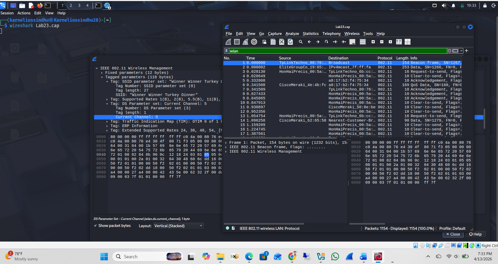
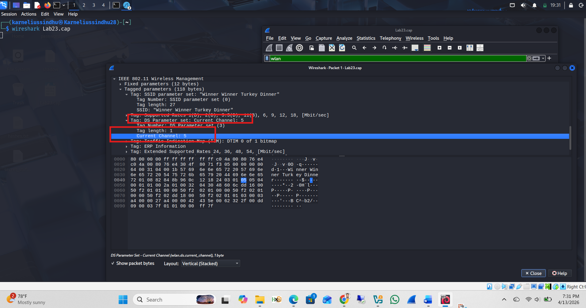
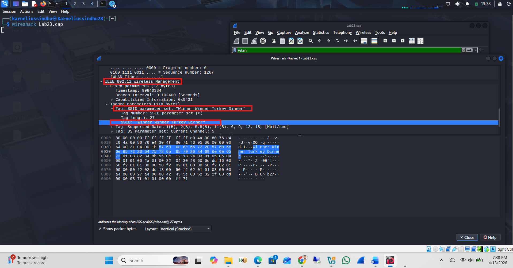
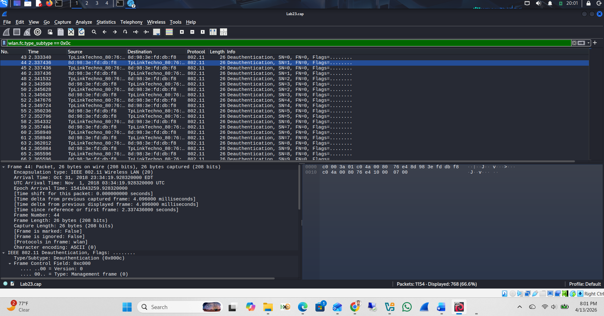
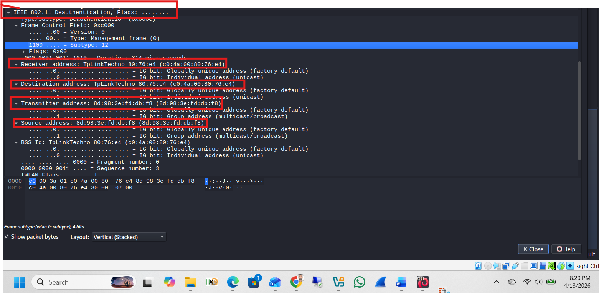
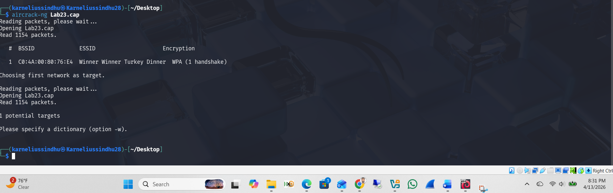
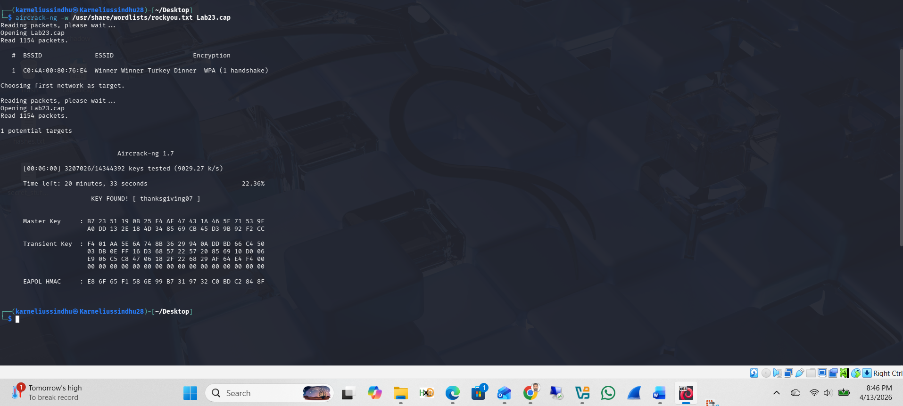
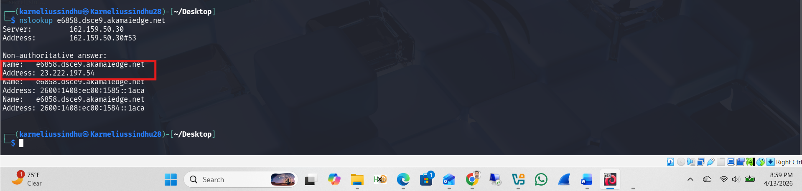

# Lab 23: Wireless Access Exploitation

**Course:** Ethical Hacking (CYBR 556)  
**Tools:** Wireshark, Aircrack-ng, Kali Linux (`nslookup`)  
**Capture File:** `Lab23.cap`

---

## Objectives

- Analyze a wireless packet capture to extract network information
- Identify a deauthentication flood (DoS) attack and its victim
- Crack the WPA/WPA2 network password using Aircrack-ng
- Identify a domain's IPv4 address

---

## Q1 — What channel was the victim network operating on?

```
Filter: wlan
Action: Open a Beacon frame → IEEE 802.11 → Tagged Parameters → DS Parameter Set → Current Channel
```

Opened `Lab23.cap` in Wireshark with the `wlan` filter applied. Clicked a Beacon frame, expanded the IEEE 802.11 Wireless Management section. Both the SSID and the DS Parameter Set (Current Channel) were visible in the same frame.



Expanded view of the DS Parameter Set showing **Current Channel: 5** highlighted in the packet detail pane.



**Answer:** Channel **5**

---

## Q2 — What is the SSID of the victim network?

Found in the same Beacon frame under the SSID parameter field.



**Answer:** `Winner Winner Turkey Dinner`

---

## Q3 — What is the MAC address of the deauthentication flood victim?

```
Filter: wlan.fc.type_subtype == 0x0c
```

This filter isolates all **deauthentication frames** (subtype 12). A flood of them was visible targeting the same MAC address repeatedly.



Expanded IEEE 802.11 Deauthentication frame showing both MAC addresses clearly labeled:

- **AP (Receiver/Destination/BSSID):** `c0:4a:00:80:76:e4`  
- **Client (Transmitter/Source — Victim):** `8d:98:3e:fd:db:f8`



**Answer:** Victim MAC = `8d:98:3e:fd:db:f8`

---

## Q4 — What is the WPA network password?

### Step 1 — Run Aircrack-ng Without Wordlist

```bash
aircrack-ng Lab23.cap
```

Aircrack-ng identified 1 target network: BSSID `C0:4A:00:80:76:E4`, ESSID `Winner Winner Turkey Dinner`, encryption WPA (1 handshake captured). Prompted to specify a dictionary with `-w`.



### Step 2 — Crack with rockyou.txt

```bash
aircrack-ng -w /usr/share/wordlists/rockyou.txt Lab23.cap
```

After testing 3,207,026 keys at ~9,000 keys/second:

```
KEY FOUND! [ thanksgiving07 ]
```



**Answer:** `thanksgiving07`

---

## Q5 — What is the IPv4 address for the target domain?

No DNS traffic was found in the capture (the `dns` Wireshark filter returned no results). Used `nslookup` on Kali instead to resolve the domain directly.

```bash
nslookup e6858.dsce9.akamaiedge.net
```

**Answer:** `23.222.197.54`



---

## Key Concepts Demonstrated

| Concept | Detail |
|---------|--------|
| Beacon Frame Analysis | Extracts SSID, channel, and AP info |
| Deauth Flood (802.11) | DoS attack forcing clients off the network |
| WPA Cracking | Dictionary attack against captured 4-way handshake |
| Wireshark Filters | `wlan`, `wlan.fc.type_subtype==0x0c` |
| Aircrack-ng | WPA handshake cracking with rockyou.txt wordlist |

---

## Remediation

| Issue | Fix |
|-------|-----|
| Dictionary-crackable WPA password | Use a long, random passphrase (20+ characters) |
| Deauth flood susceptibility | Enable 802.11w (Management Frame Protection) |
| SSID identification | Consider hidden SSID with MAC filtering as an additional layer |
