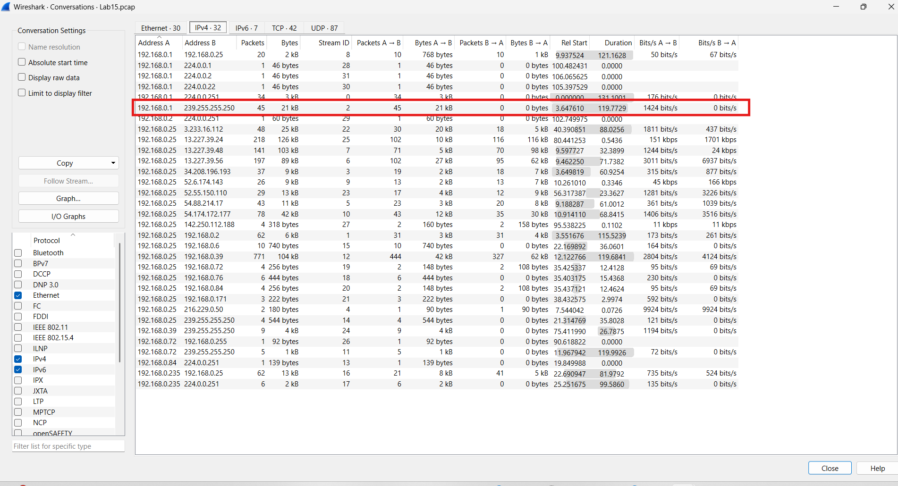
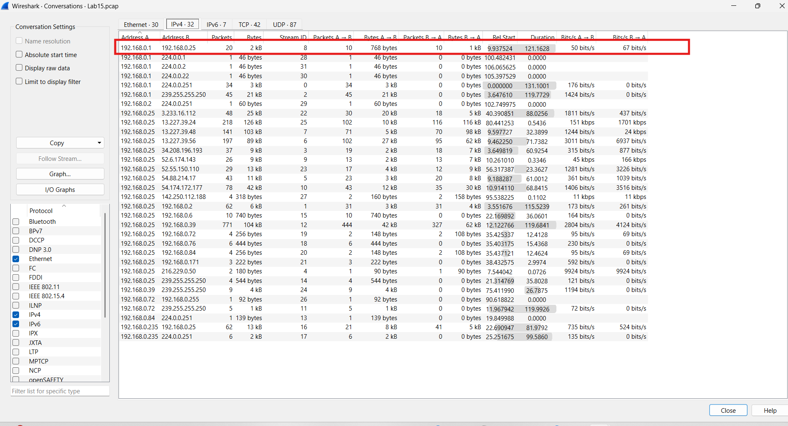
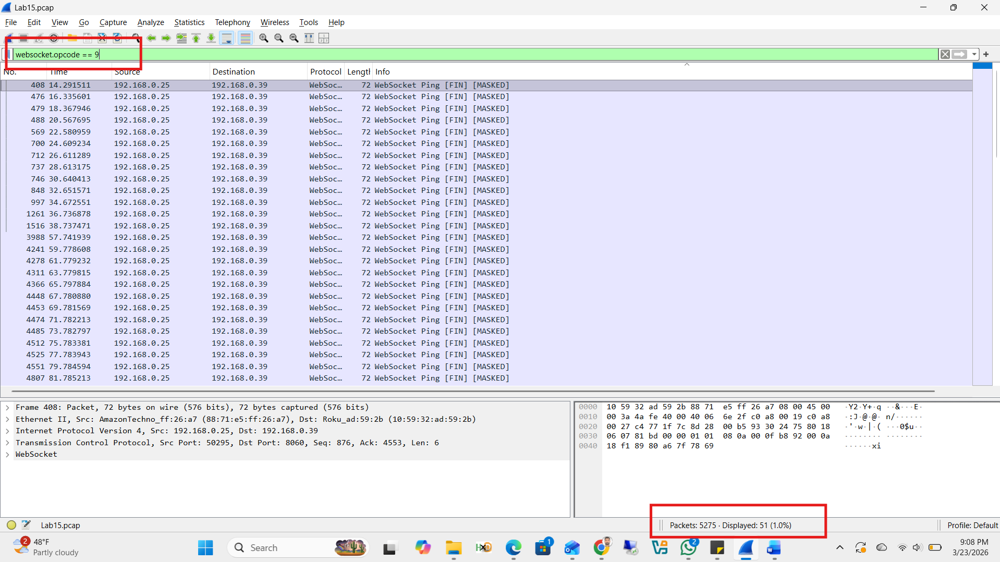
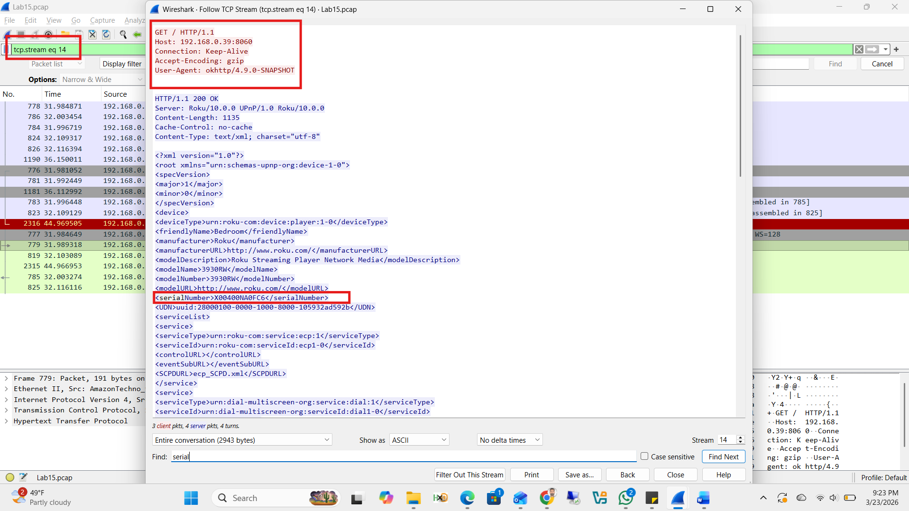

# Lab 15: Network Traffic Analysis

**Course:** Ethical Hacking  
**Tools:** Wireshark  
**Capture File:** `Lab15.pcap`  
**Focus:** Device identification, WebSocket analysis, TCP stream inspection

---

## Objectives

- Identify devices on the network from packet captures
- Analyze WebSocket traffic (ping/pong frames)
- Extract device serial numbers and application activity from HTTP/TCP streams
- Locate specific content searches within packet data

---

## Q1 — What is the streaming box IP address?

Used Wireshark Conversations (Statistics → Conversations → IPv4) to analyze traffic patterns between hosts.

`192.168.0.1` was generating SSDP and mDNS broadcast packets — protocols used by smart/IoT devices for network discovery — identifying it as the streaming device.



**Answer:** `192.168.0.1`

---

## Q2 — What is the client IP address?

In the same Conversations view, `192.168.0.25` was communicating with external servers and directly with `192.168.0.1`, consistent with a user device (phone or laptop) rather than a streaming box.



**Answer:** `192.168.0.25`

---

## Q3 — How many WebSocket Ping/Pong pairs are present?

```
Filter: websocket.opcode == 9
```

Applied the `websocket.opcode == 9` filter to isolate only WebSocket Ping frames (opcode 9). The status bar showed **51 packets displayed** — since every Ping has exactly one corresponding Pong, the total pair count is 51 each.



**Answer:** 51 Ping + 51 Pong = **102 total WebSocket frames**

---

## Q4 — What is the serial number of the streaming device?

Followed the TCP stream of HTTP traffic from the streaming device (`tcp.stream eq 14`). The XML response body contained a `<serialNumber>` field.



**Answer:** `X00400NA0FC6`

---

## Q5 — What application was launched on the streaming device?

**Steps:**
1. Applied filter: `websocket`
2. Followed TCP Stream
3. Searched (`Ctrl+F`) for `param-channel-title`

The stream data contained `param-channel-title: "Netflix"`, confirming the active application.

**Answer:** **Netflix**

---

## Q6 — What movie was searched on the streaming device?

```
Filter: frame contains "amarillo"
```

A frame containing the string `amarillo` was found. The packet contents referenced:

```
player_amarillo_4k.png
```

**Answer:** The movie searched was **Amarillo**

---

## Summary

| Question | Finding |
|----------|---------|
| Streaming box IP | `192.168.0.1` |
| Client IP | `192.168.0.25` |
| WebSocket Ping/Pong pairs | 51 each (102 total) |
| Device serial number | `X00400NA0FC6` |
| Active application | Netflix |
| Movie searched | Amarillo |

---

## Key Wireshark Techniques

| Technique | Filter / Method |
|-----------|----------------|
| Device identification | Statistics → Conversations → IPv4 |
| WebSocket Ping frames | `websocket.opcode == 9` |
| Follow TCP stream | Right-click → Follow → TCP Stream |
| Keyword search in frames | `frame contains "keyword"` |
| TCP stream selection | `tcp.stream eq N` |
